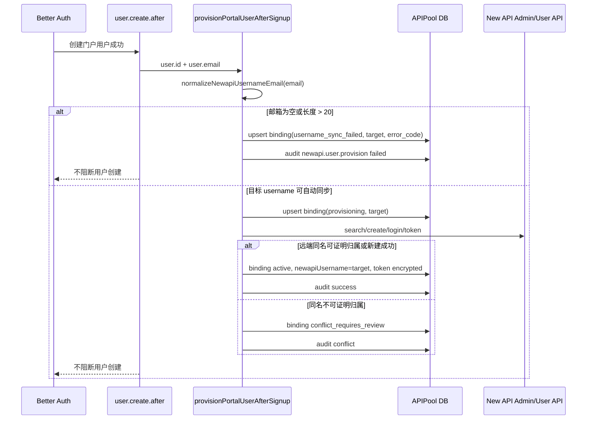
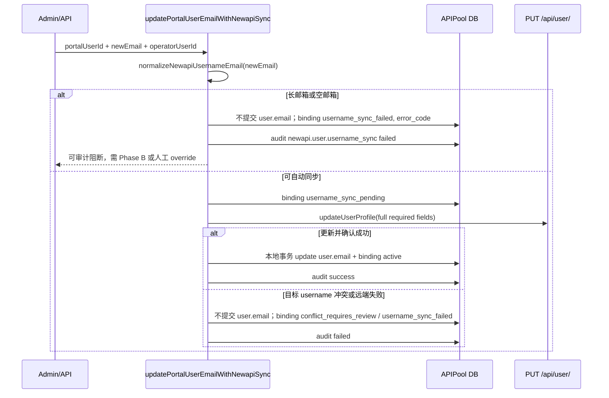
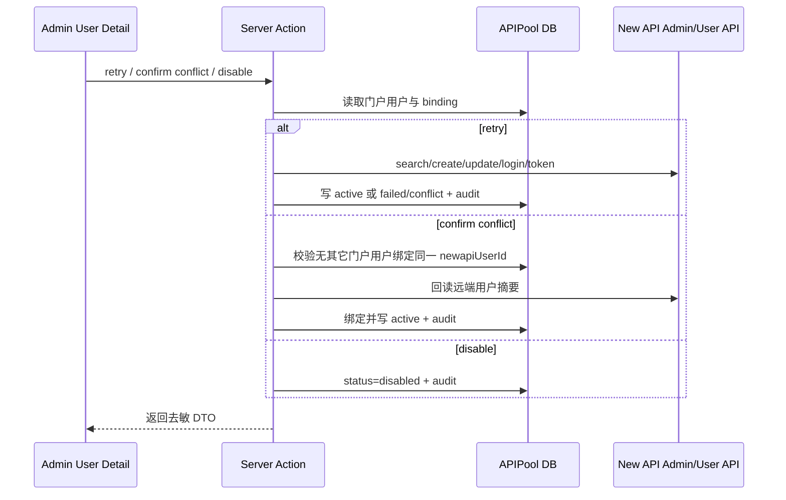
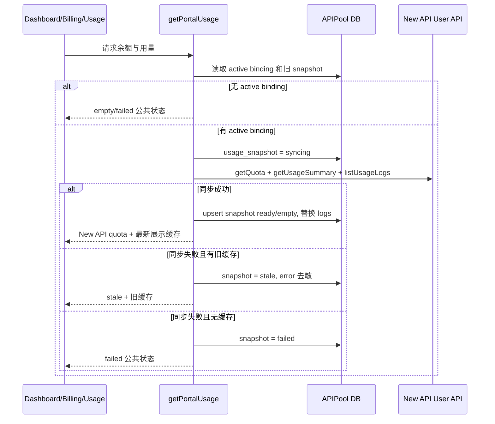
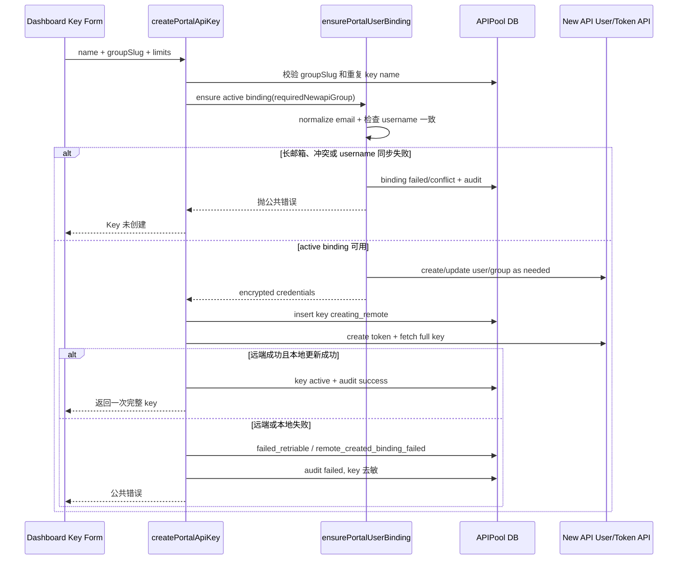

# New API 用户名与账本同步详细设计

- 状态：评审中（第 2 轮待复评）
- 作者：Codex 设计子 agent
- 评审：第 1 轮 NO-GO，已返工，等待第 2 轮复评
- 关联需求：`docs/requirements/newapi-username-ledger-sync/requirements.md`
- 日期：2026-07-03

## 0. 已确认需求与约束

- New API username 的目标值是门户用户规范化邮箱：`email.trim().toLowerCase()`。
- 不再把 `pu_<hash>` 或其它技术名作为正常目标 username。历史 `pu_<hash>` 只能作为待迁移或补偿对象识别，不能作为新目标。
- New API 上游 `Username` / `DisplayName` 当前存在 `max=20` 硬约束。本设计按“两阶段 / 条件上线”推进，而不是把 fail-closed 视为完整满足需求：
  - Phase A（本轮门户安全基础）：只自动支持 `<=20` 的规范化邮箱，交付状态、审计、短邮箱自动创建/更新、冲突阻断和补偿入口。
  - Phase A 对 `>20` 邮箱只能进入审计阻断状态，不能完整满足“所有用户 username=email”的产品诉求。
  - Phase B（产品完整上线条件）：New API 侧放宽 `Username` / `DisplayName` 长度约束（自管/patch 镜像），并至少补一轮同样的 Update User spike，证明长邮箱 update、重复 username、回读一致和失败回滚形态均可控。
  - 规范化邮箱长度 `<= 20`：允许通过自动 API 创建或更新 New API username。
  - 规范化邮箱长度 `> 20`：门户自动路径不得生成技术名冒充一致，也不得直接越权改 New API DB。绑定进入可审计失败状态，错误码为 `newapi_username_too_long`。
  - 若业务要求全量长邮箱也满足 `username=email`，需要先完成 Phase B；单独受控 SQL/运维脚本只能作为人工恢复路径，不进入门户自动热路径。
- APIPool 用户余额事实源是 New API quota。门户 ledger 是充值、调额、幂等、补偿和对账入口。`usage_snapshot` / `usage_log_snapshot` 是展示缓存。
- 注册后 provision、首次 Key 创建/调额懒 provision、邮箱变更同步、远端同名冲突、状态可观察、账本/snapshot 分工、API Key 生命周期和去敏都在本轮设计范围内。
- 本阶段只产出设计文档和评审日志，不修改生产代码、测试、配置或需求文档。

## 1. 背景与目标

APIPool_v2 采用“门户站 + New API 独立统一网关”边界。门户负责登录、充值、API Key、账单和用量展示；New API 负责真实 Key、路由、额度扣减和调用日志。

当前代码已经具备桥接骨架，但用户绑定仍以 `deriveNewapiUsername(portalUserId) => pu_<hash>` 生成远端用户名，运营人员无法在 New API 侧按邮箱直接排障、调额或对账。本设计目标是在不推倒现有 bridge 的前提下，把用户绑定目标收敛为规范化邮箱，并把 New API `max=20` 限制显式建模为阶段边界：Phase A 先交付安全基础和短邮箱自动路径；Phase B 在 New API 放宽长度限制并完成 spike 后，才算完整满足所有用户 `username=email`。

可度量目标：

- 新用户、懒 provision、邮箱变更的目标 username 均来自同一规范化 helper。
- `<=20` 邮箱自动创建/更新成功后，`newapi_user_binding` 记录目标 username、已确认 username、状态和同步时间。
- `>20` 邮箱在 Phase A 进入 `username_sync_failed`，错误码为 `newapi_username_too_long`，不会创建 `pu_<hash>`，也不被描述为产品完整上线。
- 同名远端用户只有在有归属证明时自动绑定，否则进入 `conflict_requires_review`。
- API Key、余额和 usage 继续沿现有 New API 执行、门户本地缓存展示的方向运行，并保持用户可见 DTO 去敏。

## 2. 非目标

- Phase A 不改造 New API 源码、部署镜像或数据库表结构；Phase B 是否 patch / 自管 New API 镜像是产品完整上线的前置条件，不在本轮门户代码实现内。
- 不在门户自动路径直接 SQL 修改 New API DB。
- 不把门户做成 New API 管理后台替代品。
- 不做 APIPool v1 或外部历史资产迁移。
- 不重新设计模型目录、价格、分组自动同步。
- 不在本设计阶段排逐步 implementation plan 或修改代码。

## 3. 当前系统现状

### 3.1 产品与契约文档

- `docs/01-product.md` 固定边界：真实调用扣费、额度执行和调用日志以 New API 为准；门户展示余额、请求数、Token、消费日志来自 New API 只读同步或实时查询。
- `docs/04-newapi-contract.md` 记录当前生产方向仍基于 `calciumion/new-api:latest`，曾在 `v1.0.0-rc.10` 实测核心桥接。用户供给链路为管理员 `POST /api/user/` 创建、`GET /api/user/search` 反查、用户登录、`GET /api/user/token` 生成 access token。
- `docs/04-newapi-contract.md` 已记录管理员 `PUT /api/user/` 用于更新用户分组，需要带 `id`、`username`、`display_name`、`group`、`role`、`remark` 等全量必要字段。只传局部字段存在校验或唯一约束风险。
- `docs/06-payments-ledger.md` 固定加额边界：先写门户 `apipool_ledger_entry`，再由 New API 执行 quota 变更，失败留 `pending` / `failed` / `reconciliation_required` 补偿。

### 3.2 代码现状

- `src/features/newapi-bridge/server/portal.ts`
  - `deriveNewapiUsername(portalUserId)` 当前生成 `pu_<hash>`。
  - `ensurePortalUserBinding(user, client, options)` 当前用已有 `newapiUsername` 或 `deriveNewapiUsername` 作为远端 username；已有 active binding 只在需要 group 时调用 `client.ensureUserGroup`，不校验 username 是否仍等于邮箱。
  - `createPortalApiKey()` 会先 `ensurePortalUserBinding()`，再创建本地 `newapi_key_binding` pending 行，远端成功后写 active。远端成功但本地失败时保留 `remote_created_binding_failed`。
  - `getPortalUsage()` 对 active binding 从 New API 拉 quota、summary、logs，写 `usage_snapshot` 和 `usage_log_snapshot`；失败时返回 `stale` 或 `failed`。
  - `adjustPortalQuota()` 先确保 binding，再写 ledger，再调用 `client.adjustQuota()`，成功置 `applied`，失败置 `failed` 或 `reconciliation_required`。
- `src/features/newapi-bridge/server/client.ts`
  - `provisionUser()` 按 username 搜索，找不到则 `POST /api/user/` 创建，随后登录并获取 access token。
  - `ensureUserGroup()` 通过 username 搜索后校验远端 id，再用 `PUT /api/user/` 全量更新 group。
  - `adjustQuota()` 负向调额 fallback 目前只传 `{ id, quota }`，与 `docs/04` 的全量字段要求不完全一致。本轮 profile 更新不复用该局部写法。
- `src/core/auth/config.ts`
  - Better Auth `databaseHooks.user.create.after` 当前只调用 `grantCreditsForNewUser()` 和 `grantRoleForNewUser()`；catch 后只 `console.log`，不会 provision New API 用户，也不会写 binding 失败状态。
- `src/shared/models/user.ts`
  - `UpdateUser = Partial<Omit<NewUser, 'id' | 'createdAt' | 'email'>>`，现有后台 edit helper 明确不更新 email。邮箱变更需另建 server-side helper/API hook，不能绕过同步。
- `src/config/db/schema.sqlite.ts`
  - `newApiUserBinding` 当前字段：`portalUserId` 唯一、`newapiUserId` 唯一、`status`、`newapiUsername`、加密密码和加密 access token。
  - `newApiKeyBinding`、`usageSnapshot`、`usageLogSnapshot`、`apipoolLedgerEntry`、`newApiBridgeAuditLog` 已在 sqlite schema 中存在。
- `src/config/db/schema.ts`、`src/config/db/schema.mysql.ts` 与 `src/config/db/schema.postgres.ts`
  - 当前 `src/config/db/schema.ts` 实际只导出 `schema.sqlite`，迁移目录也只有 `src/config/db/migrations_sqlite/*`。
  - `schema.mysql.ts` 与 `schema.postgres.ts` 当前未定义 New API bridge 相关表。本轮发布范围明确限定为 sqlite/libsql，不承诺 mysql/postgres 同步修改；多 provider 支持需另开 feature。

### 3.3 测试现状

- `tests/newapi-bridge/client.test.ts` 已覆盖 `provisionUser()` 创建/复用/分组、token 创建、禁用、删除、usage 和错误映射。
- `tests/newapi-bridge/portal.test.ts` 已覆盖 Key 生命周期失败状态、usage snapshot 去重/stale/failed、ledger applied/failed/reconciliation。
- `tests/newapi-bridge/create-portal-key.test.ts` 已覆盖 group server-side 解析、现有绑定补 group、重复 Key 名校验和失败清理。
- 现有测试尚未覆盖邮箱规范化、`max=20` fail-closed、注册后 provision、邮箱变更同步、同名远端归属证明和 username 更新。

## 4. 依赖与前置假设

- 官方 New API 文档存在管理员更新用户接口：[Update User，PUT `/api/user/`](https://www.newapi.ai/en/docs/api/management/user-management/user-put)，要求 Admin 权限。页面显示 `Requires Admin Permissions (Admin)` 和 `PUT /api/user/`。
- APIPool 当前 `docs/04-newapi-contract.md` 记录曾在 `calciumion/new-api:latest` / `v1.0.0-rc.10` 实测核心桥接；生产 compose 仍使用 `calciumion/new-api:latest`。
- 上游 New API main commit `8874d1929f97bb3f7fcae2af81c9e114535044f1`：
  - `router/api-router.go:140` 将管理员 `PUT /api/user/` 路由到 `controller.UpdateUser`。
  - `controller/user.go:627-682` 解码 `model.User` 后校验并调用 `EditWithTx`。
  - `model/user.go:534-565` 的 `EditWithTx` 会更新 `username`、`display_name`、`group`、`remark`。
  - `model/user.go:26-29` 定义 `Username validate:"max=20"`、`DisplayName validate:"max=20"`。
- `v1.0.0-rc.10` 同样存在 `Username max=20`，`UpdateUser` / `Edit` 也更新 `username`、`display_name`、`group`、`remark`。
- New API `CreateUser` 通过 admin API 清洗用户时只保留 `Username`、`Password`、`DisplayName`、`Role`，不保留 `Email`。`SearchUsers` 会搜索 username/email/display_name，但 admin 创建用户时 email 为空。因此“把完整长邮箱放 New API email 字段再按 email 搜索”不能作为当前 API 自动方案。

### 4.1 已完成 Update User spike（脱敏记录）

- 上游源码已拉取到 `/tmp/new-api-source`，确认 main commit 为 `8874d1929f97bb3f7fcae2af81c9e114535044f1`。源码路径与结论见本节上方，不在本文保存任何 token、cookie 或凭据。
- 临时容器 spike 使用镜像 `calciumion/new-api:latest`，容器名 `apipool-newapi-username-spike`，监听 `127.0.0.1:13019`。容器运行状态 ready，`/api/status` 回读 version 为 `v1.0.0-rc.10`。
- 端点与权限：管理员上下文 `PUT /api/user/`，请求体为全量必要用户字段，至少包含 `id`、`username`、`display_name`、`group`、`role`、`remark`。响应包络仍按 New API 约定处理：HTTP 200 不代表成功，必须检查 `success`。
- 成功形态：短 username update 成功，随后 search / 回读结果与目标 username 一致。
- 重复 username 失败形态：目标 username 已被其它用户占用时，返回 HTTP 200 + `success:false`，message 包含 `UNIQUE constraint failed: users.username`。
- 长 username 失败形态：长度 27 的 username 返回 HTTP 200 + `success:false`，message 包含 validation `max` tag。
- 回滚形态：长 username 失败后，最终用户仍保持上一次成功的短 username；门户应据此把失败视为“远端未更新”，本地不得提交邮箱变更或标记 active。

这些 spike 结论将 Phase A 自动路径限定为短邮箱。若生产镜像未来放宽 username/display_name 长度，必须用目标镜像重复同类 spike 后再进入 Phase B。

## 5. 方案概览

核心方案是小步改造现有 bridge，并把上线拆成两个明确阶段：

- Phase A：门户侧安全基础。本轮只实现 sqlite/libsql 下的状态、审计、短邮箱自动创建/更新、长邮箱阻断、admin 异常处理入口和 DTO 去敏。Phase A 可以进入工程实现，但不能宣称完整解决所有用户 `username=email`。
- Phase B：产品完整上线。New API 侧放宽 `Username` / `DisplayName` 长度约束，使用目标镜像重复 Update User spike，确认长邮箱成功、重复冲突、validation、失败后保持原 username 均符合预期后，再开放长邮箱自动同步。

Phase A 的具体门户改造：

1. 新增 `normalizeNewapiUsernameEmail(email)`，返回诊断对象或抛出可分类错误。它是注册、懒 provision、邮箱变更、测试夹具的唯一 username 目标计算入口。
2. `ensurePortalUserBinding()` 改为以规范化邮箱作为 `targetNewapiUsername`。已有 active binding 如果 `newapiUsername !== targetNewapiUsername`，先尝试 `client.updateUserProfile()` 同步远端 username/display_name/group/remark，并写审计。
3. `client.ts` 新增管理员方法 `updateUserProfile({ newapiUserId, username, displayName, group?, remark? })`。该方法先回读远端用户，校验归属并读取现有 `role`，再用 `PUT /api/user/` 全量必要字段提交；`role` 只能原样沿用远端值，不能由调用方传入。
4. `newapi_user_binding.status` 扩展为 username 同步状态机，并新增同步目标、错误、同步时间字段。
5. 注册后 hook best-effort 调用 `provisionPortalUserAfterSignup()`。失败不阻断 Better Auth 用户创建，但必须落 binding 状态和审计。
6. 邮箱变更只能通过新的 server-side helper，例如 `updatePortalUserEmailWithNewapiSync()`。普通用户邮箱变更本轮不开放；后台人工改短邮箱必须先远端 username 更新成功，再提交本地 `user.email`；长邮箱默认不提交本地 email，只记录审计阻断，除非后续人类明确接受 admin override。
7. 管理后台提供最小闭环：用户列表按 binding 状态/错误码筛选，用户详情展示 binding 状态并提供 retry / confirm conflict / disable 三个 server action。
8. 余额与 API Key 生命周期沿现有结构继续运行：写操作先确保 active binding，展示读取从 New API 同步，用户 DTO 不暴露内部字段。

被否决方案：

- 用 `pu_<hash>` 或 `email hash` 作为长邮箱替代 username：违反用户“运营可识别一致”的目标。
- 把完整长邮箱塞入 New API email 字段再搜索：当前 admin create 不保存 email，不可作为自动方案。
- 门户自动 SQL 改 New API DB：越过 New API 权限和校验边界，不适合门户应用热路径。
- 大规模抽象 gateway adapter：超出本轮范围，且现有 New API bridge 已有可演进落点。

## 6. 模块 / 文件级改动设计

| 文件 / 模块 | 改动类型 | 改什么 | 为什么 |
|---|---|---|---|
| `src/features/newapi-bridge/server/portal.ts` | 修改 | 新增/导出 `normalizeNewapiUsernameEmail()` 或放在同目录 helper；改造 `ensurePortalUserBinding()`、新增 `provisionPortalUserAfterSignup()`、新增 `syncPortalUserEmailToNewapi()` | 统一 username 目标、支持注册后和邮箱变更同步、保留现有 bridge 热路径 |
| `src/features/newapi-bridge/server/client.ts` | 修改 | 新增 `findUserById` 或扩展搜索结果校验；新增 `updateUserProfile()`；`provisionUser()` 暴露归属冲突错误或诊断 | 支持 API 更新 username/display_name/group/remark，并避免同名远端误绑 |
| `src/core/auth/config.ts` | 修改 | `user.create.after` 在 credit/role 后 best-effort 调 `provisionPortalUserAfterSignup(user)`，失败由 helper 落状态和审计 | 注册后尽早 provision，但不破坏 auth 创建 |
| `src/shared/models/user.ts` | 修改 | 保持现有 `updateUser()` 不含 email；新增专用邮箱更新 helper 不复用通用 update | 防止未来后台或 API 绕过 New API username 同步 |
| `src/config/db/schema.sqlite.ts` | 修改 | 扩展 `newApiUserBinding` 字段、status 注释和索引 | 落同步目标、失败码、错误摘要、时间和冲突证据 |
| `src/config/db/migrations_sqlite/*` | 新增 | 添加 sqlite/libsql 迁移，补字段和索引 | 本轮实际发布范围只有 sqlite/libsql |
| `src/config/db/schema.mysql.ts`、`src/config/db/schema.postgres.ts` | 不改 | 记录为范围外，不承诺 bridge 表同步 | 当前仓库未导出这些 schema，且没有 mysql/postgres 迁移目录 |
| 管理后台用户列表/详情 server action | 修改/新增 | 最小异常处理闭环：筛选 binding 状态/错误码，详情页 retry / confirm conflict / disable | 让失败状态可运营处理，而不是只落库 |
| `tests/newapi-bridge/client.test.ts` | 修改 | 覆盖 `updateUserProfile()` 成功、冲突、max=20 远端错误、确认失败 | TDD 锚定 New API API 形态 |
| `tests/newapi-bridge/portal.test.ts` | 修改 | 覆盖注册后、懒 provision、邮箱变更、长邮箱、冲突、审计和去敏 | TDD 锚定业务状态机 |
| `tests/newapi-bridge/create-portal-key.test.ts` | 修改 | 覆盖 Key 创建前 binding 非 active 或长邮箱 fail-closed，不创建错误远端用户 | 保证 Key 生命周期依赖正确 binding |

## 7. 数据结构、API 与状态流变化

### 7.1 normalized email helper

建议签名：

```ts
type NewapiUsernameEmailDiagnosis =
  | { ok: true; username: string }
  | {
      ok: false;
      code: 'portal_user_email_missing' | 'newapi_username_too_long';
      normalizedEmail?: string;
      message: string;
    };

function normalizeNewapiUsernameEmail(
  email: string | null | undefined
): NewapiUsernameEmailDiagnosis;
```

规则：

- `String(email || '').trim().toLowerCase()`。
- 空值返回 `portal_user_email_missing`。
- 长度 `> 20` 返回 `newapi_username_too_long`，不截断、不 hash。
- `<=20` 返回 `ok`，`username` 即规范化邮箱。

### 7.2 newapi_user_binding schema

本轮只支持当前实际导出的 sqlite/libsql schema：`src/config/db/schema.sqlite.ts` 与 `src/config/db/migrations_sqlite/*`。mysql/postgres 不在本轮实现范围，不新增也不承诺等价表。

| 字段 | 类型 | 可空 | 说明 |
|---|---|---:|---|
| `targetNewapiUsername` / `target_newapi_username` | text | 是 | 当前门户希望同步到 New API 的规范化邮箱 |
| `lastSyncErrorCode` / `last_sync_error_code` | text | 是 | 可分类错误码，例如 `newapi_username_too_long`、`conflict_requires_review`、`remote_error` |
| `lastSyncError` / `last_sync_error` | text | 是 | 去敏错误摘要 |
| `lastSyncAction` / `last_sync_action` | text | 是 | `signup_provision`、`lazy_provision`、`email_change`、`manual_retry`、`group_sync`、`admin_disable`、`admin_confirm_conflict` |
| `lastSyncedAt` / `last_synced_at` | integer timestamp_ms | 是 | 最近一次确认远端 username/access token/group 与本地一致的时间 |
| `lastSyncAttemptedAt` / `last_sync_attempted_at` | integer timestamp_ms | 是 | 最近一次尝试同步的时间 |
| `conflictNewapiUserId` / `conflict_newapi_user_id` | text | 是 | server-only 冲突证据，仅管理员处理 action 可读，用户 DTO 不返回 |

现有字段语义调整：

- `newapiUsername`：最后一次已确认的远端 username。历史 `pu_<hash>` 可保留在此字段，用于识别待迁移。
- `targetNewapiUsername`：当前目标 username。对于长邮箱，保存完整规范化邮箱，即使不能自动同步，也便于运营审计。
- `status` 扩展为：
  - `pending`：旧兼容 pending，可在迁移时映射到 `provisioning`。
  - `provisioning`
  - `active`
  - `username_sync_pending`
  - `username_sync_failed`
  - `conflict_requires_review`
  - `disabled`

索引：

- 保留 `portalUserId` 唯一、`newapiUserId` 唯一、`status` 索引。
- 新增 `idx_newapi_user_binding_target_username` on `targetNewapiUsername`，便于管理员按目标邮箱筛选。
- 新增 `idx_newapi_user_binding_sync_error_code` on `lastSyncErrorCode`，便于筛选长邮箱、冲突、远端错误。

迁移数据：

- 已有 `active` 且 `newapiUsername` 非空的行，`targetNewapiUsername` 初始可为空或按当前门户邮箱回填。实现阶段建议回填规范化邮箱，同时若 `newapiUsername !== target` 标记 `username_sync_pending`，但不得自动把长邮箱回填为 `active`。
- `newapiUsername LIKE 'pu_%'` 且目标邮箱 `<=20` 的行进入 `username_sync_pending`，等待懒迁移或批处理。
- 目标邮箱 `>20` 的行进入 `username_sync_failed`，`lastSyncErrorCode='newapi_username_too_long'`。

### 7.3 client API

新增类型与方法：

```ts
type NewApiUserProfileUpdateInput = {
  newapiUserId: string;
  username: string;
  displayName?: string;
  group?: string;
  remark?: string;
};

async function updateUserProfile(
  input: NewApiUserProfileUpdateInput
): Promise<{
  newapiUserId: string;
  username: string;
  displayName: string;
  group: string;
  role: number;
  remark: string;
}>;
```

实现约束：

- `username` 和 `displayName` 必须在调用前由门户 helper 校验 `<=20`。`displayName` 默认等于 username，因此同样受 `max=20` 约束。
- 更新前按 `newapiUserId` 或当前 username 取远端用户。若只能 search，则必须确认结果 id 等于本地 `newapiUserId`。
- 若目标 username 已存在且远端 id 不是当前 binding 的 `newapiUserId`，抛 `conflict_requires_review`，不得覆盖。
- `PUT /api/user/` 使用全量必要字段：`id`、`username`、`display_name`、`group`、`role`、`remark`，必要时保留远端现有 quota/status 字段不主动改动。
- `role` 不能由门户调用方传入。`updateUserProfile()` 必须先回读远端用户，把远端现有 `role` 原样提交，避免普通邮箱同步或 group 同步顺手提权/降权。
- 更新后再次 search by username，确认 id 与 username 均匹配。确认失败进入 `username_sync_failed` 或 `reconciliation_required` 类审计状态。

### 7.4 归属证明

同名远端用户只允许在以下条件之一成立时自动绑定：

- 本地已有同一门户用户 binding，且远端 id 等于本地 `newapiUserId`。
- 本地有该远端用户此前由门户生成并加密保存的密码或 access token，且能成功登录或取 token。
- 远端 `remark` 含门户写入的可验证 reference，例如 `apipool:portalUserId:<id>`，且与当前用户一致。

否则：

- `newapi_user_binding.status = 'conflict_requires_review'`。
- `targetNewapiUsername` 保存规范化邮箱。
- `conflictNewapiUserId` 保存远端候选 id。
- 写 `newapi_bridge_audit_log`，`action='newapi.user.bind_conflict'`，response/request 去敏。
- 用户侧只显示账号同步需处理，不返回远端 id。

### 7.5 注册后 provision

新增 helper：

```ts
async function provisionPortalUserAfterSignup(
  user: Pick<User, 'id' | 'email'>,
  client?: NewApiClient
): Promise<void>;
```

行为：

- 在 `src/core/auth/config.ts` 的 `user.create.after` 中 best-effort 调用。
- 若 helper 返回长邮箱/空邮箱诊断，直接写 `newapi_user_binding` 状态和 audit，不抛出到 auth hook。
- 若 New API 创建/绑定失败，写 `username_sync_failed` 或 `conflict_requires_review`，不阻断 Better Auth 用户创建。
- 若成功，状态为 `active`，`newapiUsername = targetNewapiUsername`，保存 access token 加密值。

### 7.6 邮箱变更同步

新增 server-side helper：

```ts
async function updatePortalUserEmailWithNewapiSync(input: {
  portalUserId: string;
  newEmail: string;
  operatorUserId: string;
 client?: NewApiClient;
}): Promise<{ status: 'active' | 'username_sync_failed' | 'conflict_requires_review' }>;
```

设计规则：

- 普通用户邮箱变更本轮不开放。当前后台 edit page 也禁用 email，保持不变。
- 后台人工变更短邮箱采用“远端先成功、本地后提交”事务语义：
  1. 在 server action 中计算新规范化邮箱，校验 `<=20`。
  2. 对已有 active binding 调 `client.updateUserProfile()`，并回读确认远端 username/display_name 已更新。
  3. 远端确认成功后，在本地事务中更新 `user.email`、`newapiUsername`、`targetNewapiUsername`、`lastSyncedAt`、`status='active'`，并写 audit。
  4. 如果本地提交失败，写 audit 标记 `username_sync_failed` / `reconciliation_required`，保留远端已更新证据，交由 admin retry 对账；不得把用户侧显示为成功。
- 后台人工变更长邮箱默认不提交本地 `user.email`：写 `targetNewapiUsername`、`status='username_sync_failed'`、`lastSyncErrorCode='newapi_username_too_long'` 和 audit，提示需要 Phase B 或明确的人类 admin override。
- admin override 不在本轮默认行为内；若后续人类明确接受“本地 email 先变、New API username 不一致”的临时状态，必须新增单独状态和 UI 标识，不能复用 `active`。
- 失败时不得创建新远端用户，不得把后续 Key 创建导向错误用户名。
- 若 Better Auth 或其它路径直接修改 `user.email`，必须接入相同 helper 或 post-update hook；否则视为不合规变更。

### 7.7 API Key 生命周期

- `createPortalApiKey()` 继续先调用 `ensurePortalUserBinding()`。
- 若 binding 状态不是 `active`，或 `normalizeNewapiUsernameEmail()` 返回失败，Key 创建直接失败为公共错误，不插入错误用户名远端用户。
- 已有 active binding 但 username 不一致时，`ensurePortalUserBinding()` 先同步 username。同步失败时不继续创建 Key。
- 完整 Key 仍只返回一次；列表和错误响应继续只返回本地 key id、掩码 key、展示名、状态、门户 group slug/name。
- `disablePortalApiKey()`、`deletePortalApiKey()` 使用已存 active credentials，不因长邮箱失败而重新 provision。若 binding disabled 或无 access token，保持现有失败状态和 audit。

### 7.8 余额、ledger 与 usage snapshot

- `adjustPortalQuota()` 继续先确保 active binding，再写 ledger，再调 New API quota。
- 若用户长邮箱导致无法 active binding，调额不写 `applied`，返回可审计失败，避免 ledger 表示已同步。
- 用户余额展示继续来自 `getPortalUsage()` 中 New API quota 或最新缓存；`pending` ledger 不计入可用余额。
- `usageSnapshot.status` 继续使用 `ready`、`empty`、`syncing`、`stale`、`failed`；本轮不新增 snapshot 状态。
- `usageLogSnapshot` 继续替换式刷新并用 `newapiRequestId` 去重，不参与扣费判断。

### 7.9 管理后台异常处理闭环

Phase A 的管理后台只做最小闭环，避免把异常状态留在数据库里无人可处理：

- 用户列表：
  - 增加 server-side 筛选条件：`newApiBindingStatus`、`lastSyncErrorCode`。
  - 列表 DTO 只返回门户用户字段、binding `status`、`targetNewapiUsername`、`lastSyncErrorCode`、`lastSyncAttemptedAt`、`lastSyncedAt`。不返回 `newapiUserId`、`conflictNewapiUserId`、access token、password 或完整远端响应。
- 用户详情页：
  - 展示 binding 状态、目标 username、已确认 username、最后错误码、去敏错误摘要、最后尝试/成功时间。
  - 仅管理员可见冲突候选摘要。候选远端 id 若需要展示，也必须只在管理员详情中显示，用户侧 DTO 永不包含。
- server actions / API action：
  - `retryNewapiUserBinding({ portalUserId })`：重新执行 `ensurePortalUserBinding()` / username sync，写 `lastSyncAction='manual_retry'` 和 audit。
  - `confirmNewapiUserConflict({ portalUserId, newapiUserId })`：管理员确认远端归属后绑定。action 必须再次检查没有其它门户用户绑定同一 `newapiUserId`，并写 `newapi.user.conflict_confirm` audit。
  - `disableNewapiUserBinding({ portalUserId, reason })`：把 binding 置为 `disabled`，阻断 Key 创建、调额和 usage 刷新，写 `newapi.user.binding_disable` audit。
- 用户侧：
  - 控制台只看到“账号同步中 / 账号同步需处理 / 服务暂不可用”等产品文案。
  - 用户侧 API 响应不暴露 remote id、token、password、admin token、内部 group、内部域名或 SQL/validation 原始细节。

## 8. 关键时序

### 8.1 注册后 provision



### 8.2 邮箱变更同步



### 8.3 管理后台重试 / 冲突确认流



### 8.4 余额与 usage 刷新



### 8.5 Key 创建流



## 9. 兼容性、迁移与回滚风险

- 旧 active binding 可能仍是 `pu_<hash>`。实现时不应批量直接改 New API username，先通过懒同步或受控批处理进入 `username_sync_pending`，再逐个调用 API。
- 长邮箱用户无法在未 patch 的 New API 上自动满足 username=email。Phase A 只能作为安全基础和短邮箱自动路径上线；完整产品上线前必须完成 New API 侧放宽校验和二次 spike。
- 本轮发布范围为 sqlite/libsql。`schema.mysql.ts`、`schema.postgres.ts` 和 mysql/postgres 迁移不在本轮实现范围；如果未来要支持这些 provider，必须另开 feature 补齐 bridge 表、索引、迁移和测试。
- `newapiUserId` 唯一索引与 pending 值兼容：pending 行继续使用 `pending:<uuid>`，冲突行也不得复用真实远端 id 作为 binding 的 `newapiUserId`，可用 `conflictNewapiUserId` 保存候选。
- 回滚策略：
  - 代码回滚后新增字段可保留，不影响旧代码读取。
  - 已更新成功的 New API username 不自动回滚到 `pu_<hash>`，因为目标产品已不接受技术名。
  - 短邮箱远端更新成功、本地提交失败时，通过 admin retry/confirm 对账，不自动猜测成功。
  - 长邮箱阻断状态回滚后仍不会生成技术名；需要 Phase B 或人工 override 决策。

## 10. 安全、性能、可维护性

- 安全：
  - 所有 New API 调用仍 server-only。
  - 用户可见响应不得包含 `newapiUserId`、`newapiKeyId`、access token、admin token、内部域名、内部 group、`newapiGroup`、完整 Key、密码或远端原始响应。
  - audit 中凭据字段继续脱敏；长邮箱错误可记录目标邮箱，因为 username 本身就是运营识别字段，但用户 DTO 不展示远端 id。
- 权限：
  - `updateUserProfile()` 只能用管理员上下文调用。
  - 邮箱变更 helper 必须要求操作者身份；系统动作记 `operatorUserId = system` 或约定空值。
- 性能：
  - 注册 hook 是 best-effort。若担心 auth 响应延迟，helper 可在实现阶段改成后台任务，但仍必须同步落初始 `provisioning` 或失败状态。
  - 懒 provision 发生在 Key 创建、调额等低频写路径，允许多一次 search/update。
- 并发：
  - `newApiUserBinding.portalUserId` 唯一索引继续承担幂等。
  - 邮箱变更与 Key 创建并发时，以 binding 行状态为锁边界。实现阶段可用事务更新 `username_sync_pending`，Key 创建看到非 active 则阻断。
- 可观察性：
  - 管理员可按 `status`、`targetNewapiUsername`、`lastSyncErrorCode` 筛选异常。
  - audit action 建议包括 `newapi.user.provision`、`newapi.user.username_sync`、`newapi.user.bind_conflict`、`newapi.user.group_sync`、`newapi.quota.adjust`、`newapi.key.create/disable/delete`。

## 11. TDD 测试与验证计划

### 11.1 功能 × 验证矩阵

| 功能点 | 验收标准 | 单元测试 | 功能测试 | UI 交互测试 | 失效路径验证 |
|---|---|---|---|---|---|
| 邮箱规范化 helper | `User@Example.COM ` 变 `user@example.com`；空邮箱和 `>20` 返回分类错误 | `normalizeNewapiUsernameEmail()` 覆盖大小写、空白、空值、20/21 长度边界 | N/A | N/A | 21 字符邮箱返回 `newapi_username_too_long`，不生成 `pu_` |
| 注册后 provision | 注册后 best-effort 创建/绑定 New API 用户，失败不阻断 auth，但落状态和 audit | mock helper 输入 user，断言目标 username 和错误码 | auth hook 或 helper 集成测试：成功 active；远端失败 `username_sync_failed` | 可在后续后台用户详情测试状态展示；本轮纯后端可标 N/A | New API 超时、缺配置、长邮箱、同名冲突均有 binding 状态和 audit |
| 懒 provision | Key 创建/调额首次触发时用邮箱 username，不再用 `pu_<hash>` | `ensurePortalUserBinding()` 对无 binding 用户传入短邮箱，断言 `client.provisionUser.username` | `createPortalApiKey()` 与 `adjustPortalQuota()` 集成测试断言 provision 输入 | Key 表单错误态后续 UI 测试 | 长邮箱时不调用 `client.provisionUser()`，Key/调额不写成功状态 |
| active binding username 同步 | 旧 binding username 与目标邮箱不一致时调用 `updateUserProfile()`，成功后 active | mock existing binding，断言更新调用体全量字段 | portal 集成测试：`pu_<hash>` 行迁到短邮箱，audit success | 后台详情显示旧/新 username 后续测试 | 更新失败进入 `username_sync_failed`；目标冲突进入 `conflict_requires_review` |
| 邮箱变更同步 | 邮箱变更通过专用 helper，同步 New API username 并审计 | helper 覆盖短邮箱成功、长邮箱失败、空邮箱失败 | 集成测试：更新 user.email + binding；失败不创建新远端用户 | 后台邮箱编辑开放后测试加载、提交、失败文案 | New API PUT 成功但确认失败，状态保守且 audit 标记失败 |
| 同名远端归属证明 | 只有 id/token/remark 能证明归属时自动绑定，否则冲突 | client mock search 返回不同 id，断言抛冲突错误 | `ensurePortalUserBinding()` 集成测试冲突行字段和 audit | 管理员冲突列表后续 UI 测试 | 不可证明时不登录新密码、不覆盖远端凭据 |
| `client.updateUserProfile()` | 使用管理员 `PUT /api/user/` 全量必要字段，更新后 search 确认；`role` 来自远端回读 | client 单测断言 request body 包含 `id/username/display_name/group/role/remark`，且调用方不能传 role | mock New API 成功、目标冲突、确认缺失 | N/A | 远端 `success=false`、malformed、max=20 错误映射为可分类错误 |
| schema 状态可观察 | sqlite/libsql binding 可存目标 username、错误码、错误摘要、同步时间、冲突 id | schema 类型测试或 migration smoke | sqlite migration 测试 | 管理员筛选后续 UI 测试 | 旧数据迁移保持 `portalUserId`/`newapiUserId` 唯一约束 |
| 管理后台异常闭环 | 用户列表可筛选状态/错误码；详情可 retry/confirm conflict/disable；DTO 去敏 | server action 输入校验和状态机单测 | admin action 集成测试覆盖 retry 成功、冲突确认、禁用 | 用户详情页/列表筛选后续 UI 测试 | 非管理员拒绝；confirm conflict 再查唯一归属；用户侧不返回 remote id/token/password |
| 余额事实源 | 展示余额来自 New API quota 或 snapshot；ledger pending 不算可用余额 | usd/quota 换算与 ledger 状态单测沿用 | `adjustPortalQuota()` 成功/失败/幂等现有测试扩展长邮箱阻断 | billing 页面后续 UI 测试 | New API 加额失败 ledger 不为 applied；确认失败 reconciliation |
| usage snapshot | 刷新时同步 New API；失败 stale/failed；snapshot 不参与扣费 | usage log id 去重函数现有覆盖 | `getPortalUsage()` 现有 stale/failed 测试保持并加非 active binding 状态 | dashboard/usage 后续 UI 测试 | 无 active binding、远端超时、重复 log id |
| API Key 生命周期 | 创建前必须 active binding；完整 Key 只展示一次；禁用/删除同步远端 | Key DTO 去敏函数现有覆盖扩展 | `createPortalApiKey()` 长邮箱/冲突不创建远端 key；禁用/删除失败状态沿用 | Key 表单和列表后续 UI 测试 | 远端成功本地失败保留 `remote_created_binding_failed`，response 去敏 |
| 敏感信息去敏 | 用户响应和错误不含 New API 内部 id/token/admin token/group | DTO 单测 `not.toContain` 或 node assert | portal route 集成测试 key/usage/billing 响应 | 浏览器 smoke 后续测试 | audit/request/response 中 key/token/password 为 `[redacted]` |

### 11.2 测试数据、环境与工具

- 使用现有 `tests/newapi-bridge/*` fake client 与临时 DB 测试风格。
- 新增长度边界邮箱：
  - `short@example.test` 如果长度超过 20，应改用 `a@b.co`、`user@example.com` 等短邮箱夹具。
  - 21 字符及以上邮箱用于 `newapi_username_too_long`。
- New API client 单测继续 mock fetch，断言 HTTP method/path/header/body。
- migration 测试覆盖 sqlite/libsql。本轮不做 mysql/postgres schema generation 检查，因为它们不在发布范围。

## 12. GO / NO-GO 条件

### Phase A 可进入开发条件

- Reviewer 接受本轮是 Phase A 安全基础，不宣称完整解决所有用户 `username=email`。
- 已完成的 spike 证明当前目标镜像 `calciumion/new-api:latest` / `v1.0.0-rc.10` 可用管理员 `PUT /api/user/` 更新短 username，并已记录成功、重复冲突、长 username validation 失败和失败后保持原 username。
- 设计中的 binding 状态和字段足以让注册失败、邮箱变更失败、同名冲突被管理员筛选和审计。
- 邮箱变更事务语义已固定：普通用户不开放；后台短邮箱远端成功后本地提交；长邮箱默认不提交本地 email。
- schema 发布范围固定为 sqlite/libsql，不再承诺 mysql/postgres。

### Phase A NO-GO 条件

- 如果 reviewer 认为文档仍把长邮箱 fail-closed 描述成完整满足需求，则不得进入开发。
- 如果当前生产 New API 镜像的 `PUT /api/user/` 无法稳定更新短 username，或失败形态与 spike 不一致且不可处理，则 Phase A 不得进入开发。
- 如果无法在本地状态中可靠区分“同名远端属于当前门户用户”和“同名冲突”，不得上线自动绑定。
- 如果管理后台没有 retry / confirm conflict / disable 的最小闭环，不能上线会产生 `username_sync_failed` / `conflict_requires_review` 的路径。

### 产品完整上线条件（Phase B）

- New API 自管/patch 镜像放宽 `Username` / `DisplayName` 长度，且不破坏 Create User、Search Users、Update User、token 创建、quota、日志等既有桥接。
- 用目标镜像重复 Update User spike：短邮箱、长邮箱、重复 username、失败后回读保持原 username、display_name 同步、group/remark 保留均通过。
- 长邮箱自动路径从 `username_sync_failed` 改为可自动更新，并补充迁移/重试脚本。
- Phase B 设计和评审另行记录，不把本 Phase A 文档直接当完整产品上线批准。

## 13. 未决问题

- Phase B 是否采用自管/patch New API 镜像，以及放宽到多长的 username/display_name 限制。
- 是否需要 admin override 允许“本地 email 已变但 New API username 暂不一致”的临时状态。默认不允许。
- 管理员异常入口是否在 Phase A 只放用户列表/详情，还是追加统一异常队列。默认最小闭环为用户列表/详情。
- mysql/postgres 多 provider 支持是否另开 feature。默认本轮不做。
