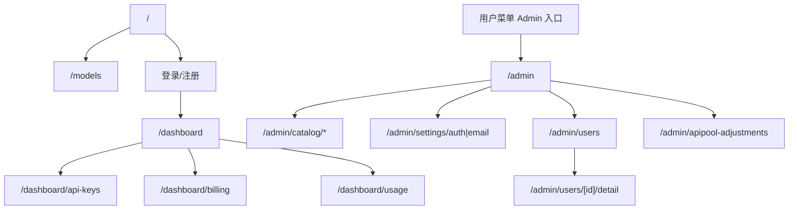
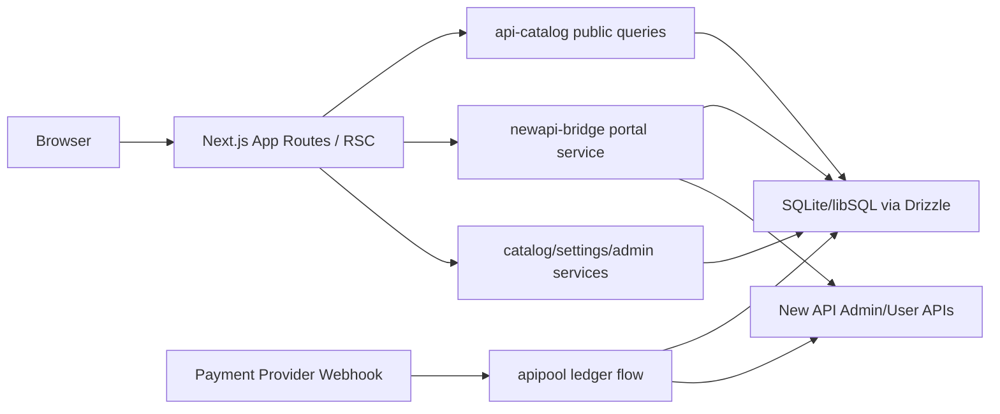
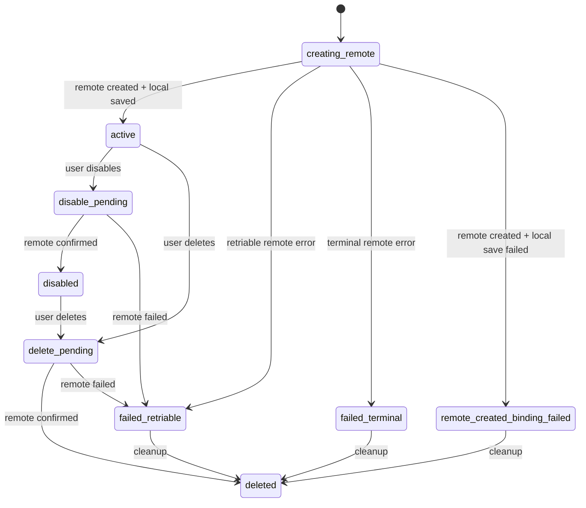
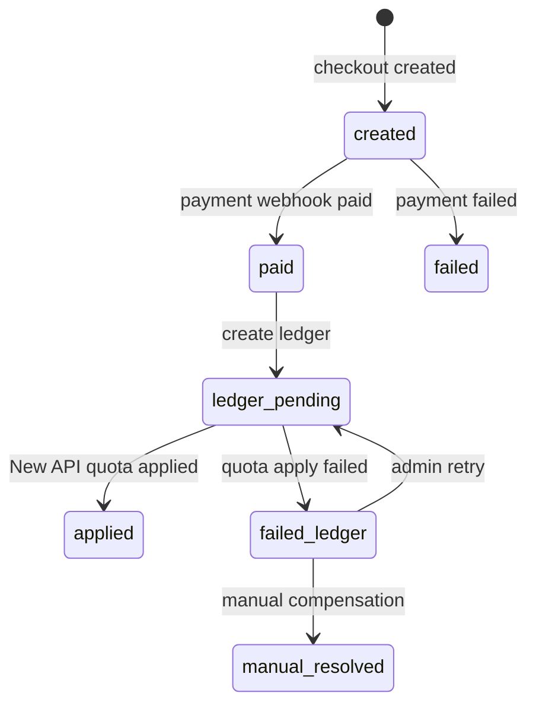

# APIPool_v2 User MVP 详细设计

> 状态：2026-06-26 需求基线修订版 / docs-only 设计评审后更新。
> 上游需求：[docs/08-user-mvp-requirements.md](../../08-user-mvp-requirements.md)。
> 评审记录：[review-log.md](review-log.md)。
> 实施计划：[PLAN.md](PLAN.md)。

## 0. 设计结论

本设计把 APIPool_v2 user-mvp 定义为“用户门户 + 运维后台”，不重做 New API 已经承担的网关能力。用户需要能完成登录、充值、浏览模型、选择分组创建 Key、真实调用、查看余额/用量/Key 状态；管理员需要能维护目录、配置登录邮件、处理支付/额度/Key/用量异常。

需求文档在产品边界上已经足够完整，可以进入设计与实施计划拆解。必须在设计中补强的点有四类：

1. 支付状态与到账状态必须分离，`pending/applied/failed` 账本状态要能被用户和管理员理解。
2. API Key 创建、禁用、删除失败不能静默成功，失败态要可清理、可审计、可排障。
3. 用量同步需要显式表达 `ready/empty/syncing/stale/failed`，并避免重复累计远端调用记录。
4. 模型目录、登录邮件配置、支付/额度异常处理都属于 `/admin` 运维后台，不进入 `/dashboard`。

## 1. 目标、范围与非目标

### 1.1 版本目标

用户最小闭环：

`注册/登录 -> 在线充值或管理员发放额度 -> 查看模型和价格 -> 选择分组创建 API Key -> 真实调用模型 -> 在控制台看到余额、用量和 Key 状态`

管理员最小闭环：

`维护目录 -> 配置登录/邮件/支付依赖 -> 处理用户额度 -> 查看用户 Key/用量/账本 -> 清理关键异常 -> 完成上线验收`

### 1.2 本版本范围

- `/models`：展示供应商、分组、分类、能力、状态、价格、折扣、是否可调用。
- 登录注册：Google、GitHub、邮箱；邮箱链接验证可配置，但不阻塞已登录用户创建 API Key。
- `/dashboard`：余额、最近请求、输入 Token、输出 Token、消费金额、API Base URL、充值入口、Key 管理、用量状态。
- API Key：按门户 `groupSlug` 创建，服务端映射 New API group；支持复制、禁用、删除、失败清理。
- 支付与额度：在线充值、支付状态、到账状态、账本幂等、管理员增减额度。
- `/admin`：目录 CRUD、登录邮件配置、用户详情、Key/用量/账本异常处理。
- 验收：自动测试、真实或等价 New API smoke、真实浏览器走查和截图留痕。

### 1.3 明确不做

- 不做 `/docs` 快速接入文档作为上线门槛。
- 不做邮箱验证码输入、Playground、模型详情页、团队/组织、导出、复杂发票、复杂营销。
- 不向普通用户暴露 New API 后台入口、内部 ID、`newapiGroup`。
- 不做门户与 New API 的模型/价格/分组自动同步。
- 不做分组连通性自动自检、Key 受影响模型分析。
- 不做模型级 Key 权限、单 Key 余额限制、单 Key budget、rate limit。
- 不做 WebSocket 或自动轮询刷新余额、用量、Key 状态。
- 不做完整 routing、fallback、observability 平台化能力；这些继续由 New API 或现有基础设施承担。

## 2. 当前实现校准

本设计不是 2026-06-24 冻结稿的简单延续，而是按 2026-06-26 需求基线重新校准后的版本。当前代码中已经存在或需要继续保持的事实如下：

| 领域     | 当前事实                                                                                        | 设计要求                                                                 |
| -------- | ----------------------------------------------------------------------------------------------- | ------------------------------------------------------------------------ |
| 数据库   | 首发 schema 以 `src/config/db/schema.sqlite.ts` 为事实源                                        | user-mvp 继续冻结 sqlite/libsql 首发边界                                 |
| 模型目录 | 已有 `catalog_vendor/category/capability/status/group/model/model_listing`                      | 设计必须纳入分类字典，不再把分类当不可管理字符串                         |
| 目录后台 | `/admin/catalog/*` 已按供应商、分组、分类、能力、状态、模型、售卖项拆分                         | 所有目录管理继续走 `/admin` + RBAC                                       |
| Key 创建 | `groupSlug -> catalog_group.id/newapiGroup` 在服务端解析                                        | 浏览器只提交 `groupSlug`，公共响应不含内部 ID / `newapiGroup`            |
| Key 状态 | 已有 `creating_remote/active/disable_pending/delete_pending/disabled/deleted/failed_*` 等内部态 | 用户态合并为创建中、可用、禁用中、已禁用、删除中、已删除、创建或同步失败 |
| 失败清理 | 失败态支持 cleanup，列表过滤 `deleted`                                                          | 设计要把失败清理作为产品能力，而非临时修补                               |
| 用量     | `usage_snapshot`/`usage_log_snapshot` 有状态、输入/输出 token、替换式刷新                       | 设计要明确 stale/failed 体验和重复记录去重策略                           |
| 支付账本 | `apipool_ledger_entry` 与 `order` 分离                                                          | 设计要区分支付状态和到账状态                                             |
| 验收     | 已有 `npm test`、`npm run smoke:mvp`                                                            | 发布验收还需要真实浏览器 UI/i18n/集成走查截图                            |

## 3. 需求完整性评审

### 3.1 完整项

- 用户目标、管理员目标和非目标清晰，足以阻止 scope creep。
- `/dashboard` 与 `/admin` 边界明确：用户自助能力在 `/dashboard`，管理与异常救援在 `/admin`。
- 模型目录、分组、价格、折扣、状态、分类、能力都定义为后台可维护。
- Key 管理明确为“用户 + 分组”绑定，不进入模型级授权、budget、rate limit。
- 支付与额度明确要求订单支付状态与额度到账状态分离。
- 用量同步状态和输入/输出 token 维度已进入需求。
- 外部依赖验收已经列出 OAuth、Resend、支付、New API、真实调用。

### 3.2 必须在设计中补齐的假设

- `catalog_model.category` 保存分类 slug，分类元数据由 `catalog_category` 管理；分类不承担 New API 路由语义。
- 同一 `modelId + groupId` 唯一；同一 `modelId` 可在不同分组下形成多个售卖项。
- `newapiGroup` 只在后台和服务端使用，公共查询类型和 API 响应均不得包含。
- 已删除 Key 不再进入用户列表；失败 Key 可以被用户清理，管理员仍可通过审计与数据库追踪。
- 用量同步失败时优先展示上次可用快照；没有可用快照时展示 failed/empty，而不是制造 0 用量成功错觉。
- 支付回调幂等以 `orderNo`/账本唯一索引为底线；到账失败保持可重试或人工处理。

### 3.3 可暂缓澄清

- 首批模型与分组命名、折扣文案、价格数值属于运营配置，发布前配置即可。
- 支付失败重试队列可以先由后台人工处理承载，自动化重试不作为 user-mvp 门槛。
- New API 真实 smoke 可以使用真实环境或本地等价环境，但发布前至少要有一条 live/equivalent 证据。

## 4. 信息架构与用户流程

### 4.1 页面结构



### 4.2 用户流程

1. 未登录用户访问 `/models`。
2. 用户按供应商、分组、分类、能力、状态筛选模型。
3. 用户登录后进入 `/dashboard`，看到余额、API Base URL、最近请求、token 与消费概览。
4. 用户充值或由管理员发放额度；支付成功但未到账时在账单页看到“到账处理中”。
5. 用户进入 `/dashboard/api-keys`，选择门户分组 `groupSlug` 创建 Key。
6. 服务端创建或复用 New API 用户，按 `newapiGroup` 创建远端 Key，本地保存绑定。
7. Key 创建成功后完整 Key 只展示一次；列表展示掩码、分组、状态。
8. 用户用 Key 调用 `APIPOOL_PUBLIC_CONFIG.apiBaseUrl`。
9. 用户在 `/dashboard` 或 `/dashboard/usage` 看到余额、请求数、输入/输出 token、消费金额、模型分布和同步状态。
10. 用户可禁用或删除 Key；远端同步失败时看到失败状态并可清理失败记录。

### 4.3 管理员流程

1. 管理员进入 `/admin/catalog/*`，维护供应商、分类、能力、状态、分组、模型和售卖项。
2. 管理员为门户分组配置 `newapiGroup`，并手动确保 New API 侧存在对应 group。
3. 管理员将至少一个售卖项标为可用，并完成真实或等价调用验证。
4. 管理员在 `/admin/settings/auth`、`/admin/settings/email` 配置 OAuth 与 Resend。
5. 管理员在用户列表进入详情页，查看余额、用量、Key、调额历史。
6. 管理员通过调额页增加或扣减用户额度，系统写入账本和审计。
7. 管理员处理 Key 创建失败、远端 Key 已创建但本地绑定失败、入账失败、用量同步失败等异常。

## 5. 架构设计

### 5.1 分层



### 5.2 模块职责

| 模块                                         | 职责                                                   | 边界                                       |
| -------------------------------------------- | ------------------------------------------------------ | ------------------------------------------ |
| `api-catalog/server/queries.ts`              | 公共目录查询、筛选维度、可建 Key 分组、可调模型范围    | 返回类型不得包含内部 ID / `newapiGroup`    |
| `api-catalog/server/catalog-service.ts`      | 管理员目录 CRUD                                        | 仅 `/admin` 使用，写后 revalidate catalog  |
| `api-console/lib/status.ts`                  | Key 生命周期与用量同步状态纯函数                       | 状态流测试必须覆盖失败态                   |
| `api-console/components/api-key-manager.tsx` | 用户 Key 表单、列表、复制、禁用、删除、失败清理        | 只能提交 `groupSlug`，不能提交内部 ID      |
| `newapi-bridge/server/portal.ts`             | 用户绑定、Key 创建/禁用/删除、用量同步、账本投影、调额 | server-only，所有 New API 调用在服务端完成 |
| `apipool-ledger`                             | 支付/调额账本草稿、幂等、状态                          | 支付状态与到账状态分离                     |
| `/admin/settings/*`                          | OAuth、Resend、邮箱验证开关配置                        | Secret 不在用户侧泄露                      |

### 5.3 缓存与一致性

- 目录公共查询使用 `unstable_cache` + `catalog` tag。
- 管理员目录写操作后调用 `revalidateCatalog()`。
- 用量同步以 `usage_snapshot` 为聚合快照，以 `usage_log_snapshot` 为最近明细缓存。
- 用量明细采用替换式刷新，避免同一远端调用多次同步后重复累计。
- Key 列表读取时尽力同步远端状态；同步失败返回本地状态，不静默改成功。

## 6. 数据模型

### 6.1 模型目录

| 表                         | 关键字段                                                                                                   | 说明                                     |
| -------------------------- | ---------------------------------------------------------------------------------------------------------- | ---------------------------------------- |
| `catalog_vendor`           | `slug/name/status/sortOrder`                                                                               | 供应商字典                               |
| `catalog_category`         | `slug/name/status/sortOrder`                                                                               | 分类字典，供 `/models` 和 admin 表单使用 |
| `catalog_capability`       | `slug/name/status/sortOrder`                                                                               | 能力字典                                 |
| `catalog_status`           | `slug/name/isCallable/isPublicVisible/status/sortOrder`                                                    | 售卖项状态字典                           |
| `catalog_group`            | `slug/name/userDescription/newapiGroup/allowCreateKey/status/sortOrder`                                    | 门户分组与 New API group 映射            |
| `catalog_model`            | `modelId/displayName/vendorId/category/contextWindow`                                                      | 模型本体；`category` 保存分类 slug       |
| `catalog_model_capability` | `modelId/capabilityId`                                                                                     | 模型能力多对多                           |
| `catalog_model_listing`    | `modelId/groupId/statusId/inputMicroUsd/outputMicroUsd/list*MicroUsd/discountNote/description/smokeTested` | 售卖项；`modelId + groupId` 唯一         |

公共 `/models` 输出必须只包含：

- `modelId/displayName/vendorName/groupName/groupSlug/category/capabilities/contextWindow`
- `inputMicroUsd/outputMicroUsd/listInputMicroUsd/listOutputMicroUsd/discountNote/description`
- `statusSlug/statusName/isCallable`

不得包含：

- `catalog_* .id`
- `newapiGroup`
- New API 后台 URL 或后台名称

### 6.2 New API 绑定

| 表                        | 关键字段                                                                                                                          | 说明                        |
| ------------------------- | --------------------------------------------------------------------------------------------------------------------------------- | --------------------------- |
| `newapi_user_binding`     | `portalUserId/newapiUserId/status/newapiUsername/newapiPasswordEnc/newapiAccessTokenEnc`                                          | 门户用户与 New API 用户绑定 |
| `newapi_key_binding`      | `portalUserId/newapiUserId/newapiKeyId/keyMasked/displayName/status/groupId/newapiGroup/idempotencyKey/lastRemoteError/deletedAt` | 门户 Key 与远端 Key 绑定    |
| `newapi_bridge_audit_log` | `action/targetType/status/idempotencyKey/requestBody/responseBody/errorMessage`                                                   | 所有关键远端变更留审计      |

`newapi_key_binding.newapiGroup` 是创建时快照，仅用于排障和审计；用户列表和公共 API 只展示 `groupName`。

### 6.3 用量与账本

| 表                     | 关键字段                                                                                                                           | 说明         |
| ---------------------- | ---------------------------------------------------------------------------------------------------------------------------------- | ------------ |
| `usage_snapshot`       | `portalUserId/range/balanceUsd/quotaRemaining/requestCount/inputTokens/outputTokens/spendUsd/byModel/status/errorMessage/syncedAt` | 用量聚合快照 |
| `usage_log_snapshot`   | `portalUserId/newapiRequestId/keyMasked/modelId/status/inputTokens/outputTokens/spendUsd/createdAt/syncedAt`                       | 最近调用明细 |
| `order`                | `orderNo/userId/status/amount/currency/paymentProvider/paidAt`                                                                     | 支付订单事实 |
| `apipool_ledger_entry` | `portalUserId/operatorUserId/newapiUserId/orderNo/amountUsd/source/status/executor/reason/newapiChangeId/rollbackStatus`           | 额度到账事实 |

展示金额约定：

- `order.amount` 是支付渠道金额，单位为 cents。
- `apipool_ledger_entry.amountUsd` 是美元数值，`5` 表示 `$5.00`，不得再除以 100。
- `usage_snapshot.spendUsd` 与 New API 返回单位保持集中转换，不在 UI 分散换算。

## 7. 状态流

### 7.1 API Key 状态

内部状态：

| 内部状态                        | 用户文案       | 可执行动作               |
| ------------------------------- | -------------- | ------------------------ |
| `creating_remote`               | 创建中         | 可清理失败/卡死记录      |
| `active`                        | 可用           | 复制、禁用、删除         |
| `disable_pending`               | 禁用中         | 等待远端确认             |
| `disabled`                      | 已禁用         | 删除                     |
| `delete_pending`                | 删除中         | 等待远端确认             |
| `deleted`                       | 已删除         | 默认不展示               |
| `failed_retriable`              | 创建或同步失败 | 清理；管理员可排障       |
| `failed_terminal`               | 创建或同步失败 | 清理；管理员可排障       |
| `remote_created_binding_failed` | 创建或同步失败 | 清理；管理员可按审计补偿 |

状态转移：



关键规则：

- 完整 Key 只在 `active` 创建成功响应中返回一次。
- 禁用/删除必须尽力同步 New API；失败时转失败态，不展示为成功。
- 清理失败态允许本地置 `deleted`；如远端可能存在残留则尽力删除，失败不阻塞用户清理。
- 删除后的 Key 不进入用户列表，不作为同名冲突对象。
- 用户不需要看到内部状态名；管理员可在审计日志和详情页追踪内部状态。

### 7.2 支付与额度状态



展示规则：

- `order.status=paid` 且 `ledger.status=pending`：用户看到“到账处理中”。
- `ledger.status=applied`：用户看到“已到账”，余额应可见。
- `ledger.status=failed`：用户看到“到账失败/请联系支持”，管理员后台可重试或人工处理。
- 重复支付回调不得重复入账；账本 `orderNo` 唯一。
- `pending` 期间余额不足提示优先指向“充值到账处理中”，避免误判为未付款。

### 7.3 用量同步状态

| 状态      | 含义                           | 用户体验                                      |
| --------- | ------------------------------ | --------------------------------------------- |
| `ready`   | 最新同步成功且有可展示数据     | 展示余额、请求数、token、消费、模型分布和明细 |
| `empty`   | 同步成功但暂无调用             | 展示空态，不报错                              |
| `syncing` | 正在同步                       | 展示处理中，可保留旧数据                      |
| `stale`   | 同步失败但有旧快照             | 展示旧数据并提示可能延迟                      |
| `failed`  | 同步失败且无可用快照或快照过旧 | 展示失败状态，管理员可查错误                  |

用量明细的 React key 不得只依赖远端 `newapiRequestId`，因为同一远端请求 ID 可能出现多条明细；列表渲染需要本地唯一行 ID 或索引兜底。

## 8. 边界情况与救援

| 场景                            | 处理                                                                 |
| ------------------------------- | -------------------------------------------------------------------- |
| 分组不存在、禁用或不允许建 Key  | POST `/api/apipool/keys` 返回明确错误，不调用 New API                |
| 用户未验证邮箱但已登录          | 允许创建 Key                                                         |
| 同名未删除 Key 已存在           | 前端/服务端提示重名；删除或清理后可复用                              |
| 远端 Key 创建失败               | 本地记录失败态、错误摘要和审计，不显示完整 Key                       |
| 远端 Key 创建成功但本地保存失败 | 进入 `remote_created_binding_failed`，管理员可按审计补偿，用户可清理 |
| 禁用/删除远端失败               | 转失败态，不静默成功                                                 |
| 已删除 Key 仍在远端可见         | 后台按审计排查；用户侧不展示为可用                                   |
| 支付成功但入账失败              | 账本 failed，用户侧显示到账失败/处理中，管理员重试或人工处理         |
| 重复 webhook                    | 幂等处理，不重复入账                                                 |
| 用量同步失败且有旧数据          | stale 展示旧数据和延迟提示                                           |
| 用量同步失败且无旧数据          | failed 空态，管理员可查错误                                          |
| `newapiGroup` 配错              | smoke 或真实调用失败；管理员修正分组映射后重测                       |
| i18n namespace 未注册           | 浏览器走查必须捕获 raw key，不能只看翻译 JSON 文件                   |

## 9. 安全、权限与隐私

- `/admin` 所有目录、设置、用户详情、调额能力都受 RBAC 保护。
- `/dashboard` 永远只展示当前登录用户自己的余额、Key、用量和账单。
- 公共 `/models` 不暴露内部 ID、`newapiGroup`、New API 后台入口。
- Secret 配置只在后台表单和服务端使用，用户侧不下发。
- 审计日志中的远端 Key 原文必须 redacted；完整 Key 只在创建成功响应中展示一次。
- 错误提示面向用户时必须去敏，不透出 admin token、New API 内部凭据、请求体密钥。

## 10. 测试策略

### 10.1 自动化测试

必跑命令：

```bash
npm test
```

重点覆盖：

- catalog 查询：公共输出不含内部 ID / `newapiGroup`；筛选维度覆盖供应商、分组、分类、能力、状态。
- catalog service：分类、供应商、分组、能力、状态、模型、listing CRUD；同一 `modelId + groupId` 唯一。
- Key input：`groupSlug` 必填，payload 不含 `allowedModels`、内部 ID、`newapiGroup`。
- Key 状态：创建成功、远端失败、本地保存失败、禁用、删除、清理失败态。
- Billing ledger：`amountUsd=5` 展示 `$5.00`，订单支付状态与账本到账状态分离。
- Usage：`ready/empty/syncing/stale/failed`、输入/输出 token、替换式刷新、重复明细 key 兜底。
- Admin 用户详情：无 binding、用量失败、Key/ledger 空态均不崩溃。

### 10.2 Smoke

本地或等价环境：

```bash
npm run smoke:mvp
```

真实 New API 环境：

```bash
APIPOOL_SMOKE_REQUIRE_LIVE=true npm run smoke:mvp
```

smoke 至少验证：

- official 分组的 `newapiGroup` 已与 New API 对齐。
- 用户创建 Key 时传 `groupSlug`。
- 真实或等价 `/v1` 调用成功。
- 用量可见，输入/输出 token 进入快照。
- 禁用 Key 后不能继续调用。

### 10.3 真实浏览器验收

发布前必须用真实浏览器走查并截图留痕：

- `/models`：筛选、分类、分组、价格、折扣、状态，不出现 New API 内部字段。
- `/dashboard`：余额、API Base URL、最近请求、输入/输出 token、同步状态。
- `/dashboard/api-keys`：建 Key 下拉、同名提示、完整 Key 一次性展示、失败 Key 清理、删除后不再展示为可用。
- `/dashboard/billing`：支付状态、到账状态、到账处理中、到账失败文案。
- `/admin/catalog/*`：供应商、分组、分类、能力、状态、模型、listing 表单与列表，无 raw i18n key。
- `/admin/settings/auth`、`/admin/settings/email`：OAuth/Resend 字段、密码掩码、保存反馈。
- `/admin/users/[id]/detail`：余额、用量、Key、调额历史空态和失败态。

真实浏览器验收是 user-mvp 的发布门槛之一；静态评审与单测不能替代 UI/i18n/集成层验证。

## 11. 验收标准

### 11.1 用户验收

- 新用户可以完成 Google、GitHub 或邮箱注册登录。
- 邮箱注册用户可以收到验证链接。
- 已登录用户可以创建 API Key，不因邮箱未验证被阻止。
- `/models` 至少有一个可用模型，展示分组、分类、价格、折扣和状态。
- 用户选择分组创建 API Key，完整 Key 只展示一次。
- 用户能复制 Key，并真实或等价调用至少一个模型成功。
- 禁用 Key 后不能继续调用。
- 删除 Key 后列表不再把它展示为可用 Key。
- 用户可以在线充值并看到余额变化。
- 支付成功但额度未到账时，用户能看到到账处理中。
- 调用后 `/dashboard` 展示余额减少、输入/输出 token、请求记录和模型分布。
- 用量为空、同步中、延迟或失败时，用户看到明确状态。

### 11.2 管理员验收

- 管理员可以新增、编辑、禁用供应商、分组、分类、能力、状态、模型和售卖项。
- 管理员可以让同一个模型 ID 出现在不同分组下，并配置不同价格。
- 管理员可以配置门户分组和 New API group 的对应关系。
- 管理员可以把模型从“即将上线”改为“可用”，并让用户创建 Key 后调用。
- 管理员可以下线模型或分组，用户侧看到明确状态。
- 管理员可以配置 Google、GitHub、Resend 和邮箱链接验证开关。
- 管理员可以查看支付订单、账本流水和到账状态。
- 管理员可以对用户额度执行增加和扣减。
- 管理员可以查看额度调整记录、用户用量和 Key 列表。
- 管理员可以识别并处理 Key 创建失败、入账失败、用量同步失败。

### 11.3 发布前证据

- `npm test` 通过。
- `npm run smoke:mvp` 通过；需要 live 环境时 `APIPOOL_SMOKE_REQUIRE_LIVE=true npm run smoke:mvp` 通过。
- 真实浏览器验收截图覆盖用户侧和后台关键路径。
- 至少一个 provider、一个分组、一个模型完成真实或等价调用验证。
- review-log 中“必须修改”项全部关闭或有明确延期批准。

## 12. 后续 12 个月方向

以下能力重要，但不进入 user-mvp：

- 模型路由、fallback、动态供应商选择。
- 用户级 budget、rate limit、更复杂成本控制。
- 完整观测、告警、运营 dashboard、异常自动化。
- 团队、组织、成员权限和企业账单。
- 完整开发者文档、Playground、SDK 示例和迁移工具。
- 用量导出、发票、营销活动和客户生命周期运营。
