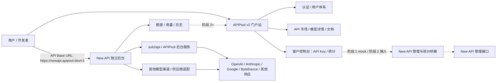

# APIPool v2 品牌升级设计方案

## 1. 背景与目标

当前 APIPool 源自 sub2api 改造，本质是 API 反代与模型调度系统。它已经具备真实网关、API Key、用户余额、用量日志、模型路由、账号池和运维排障能力，但产品表达仍偏“后台系统”，不适合承担新品牌的获客、展示、文档和商业转化。

APIPool v2 的目标不是给现有 APIPool 换皮，而是建立一个新的 API 门户网站，参考 APIMart 的产品形态，面向开发者提供：

- API 市场：展示模型品类、能力、价格、折扣和供应商。
- API 文档：提供 OpenAI 兼容迁移、各类端点和代码示例。
- 客户控制台：第一阶段优先只做 API Key 管理前端页；余额、充值、用量、任务、消费日志等能力后续通过 New API 统计接口补齐。
- 实际 API 后台：额外部署一个 New API 项目作为独立统一网关，例如 `newapi.apipool.dev`，由 New API 接入 sub2api/APIPool 或其他渠道，并负责“一把 API Key 访问多个模型”的真实调用能力；门户站不在第一版实现通用网关适配层。

整体方向是“重展示，轻管理”。新站侧重点是市场展示、支付能力和基本控制台管理；复杂账号池、供应商配置、风控、日志排障、模型路由策略继续留在后端网关或运营后台。

## 2. 参考对象：APIMart 关键设计

APIMart 的核心不是普通 SaaS landing，而是一个“API 市场 + 文档 + 轻控制台 + 增长内容”的组合。

可借鉴的结构：

- 首页强调“一个端点、多模型、折扣、快速接入”，第一屏直接回答为什么用它。
- API 市场是核心入口，按图像、视频、LLM、最新分类，并支持模型能力、供应商筛选。
- 模型卡片展示模型 ID、简介、单位价格、官方价和折扣。
- 模型详情页承担转化：模型介绍、Playground、定价表、快速开始、FAQ、相关模型、获取 API Key。
- 文档站强调 OpenAI 兼容迁移，核心卖点是只改 Base URL 和 API Key。
- 控制台是轻控制台，包括总览、API Key、任务日志、消费日志、导出记录、充值账单、活动、Agent。
- 增长内容包括 API 更新、博客、竞品替代页、垂直场景页，用于 SEO 和转化。

APIPool v2 不需要一次性复制全部体验。第一阶段只保留展示、文档、价格和 API Key 管理前端骨架；实际模型调用交给独立 New API 后台，后续再补支付、用量统计、Playground、活动、内容矩阵和更完整的数据分析。

## 3. 产品定位

APIPool v2 定位为“多模型 API 门户和商业控制台”，而不是“统一运维后台”。

面向用户：

- 开发者：想用一个 Base URL 和一个 Key 调用多个模型。
- 小团队/SaaS 开发者：关心接入简单、价格透明、余额可控、模型更新快。
- 高消耗工具用户：例如 OpenClaw、Codex、Claude Code、图像/视频生成工作流用户。

核心价值主张：

- 一个端点接入多类模型。
- 价格透明，能看到官方价、本站价、折扣和计费单位。
- 可快速获取 API Key，并能查看余额、消耗和充值记录。
- 文档和示例代码足够清楚，降低从 OpenAI 或其他平台迁移的成本。

## 4. 总体架构

推荐采用“门户站 + New API 独立统一网关”的轻架构。门户站负责品牌展示、市场、文档、登录、API Key 管理和统计展示；独立 New API 实例负责真实 API Key、模型路由、渠道接入、余额/额度扣减和调用日志。New API 再向下接 sub2api/APIPool 或其他渠道，由这些渠道继续对接具体上游模型供应。

### 4.1 前台门户

基于 `/Users/afreecoder/project/shipany-template` 开发，优先复用：

- Next.js、Tailwind、shadcn/radix 组件体系。
- Better Auth 登录注册。
- Stripe / PayPal / Creem 等支付扩展基础。
- Order、Subscription、Credit、API Key 等已有数据模型。
- Settings、Billing、Credits、Payments、API Keys 页面骨架。
- Fumadocs / MDX 文档能力。
- Blog、landing blocks、多语言和主题能力。
- Admin / RBAC / settings 基础后台。

### 4.2 New API 独立后台

New API 独立后台负责实际 API 调用链路：

- API Key 鉴权。
- 模型路由。
- 渠道接入：sub2api/APIPool、其他模型渠道、供应商适配服务。
- 供应商账号池或渠道账号池。
- 请求转发。
- 用量计费执行。
- 失败切换、限流、风控、审计和运维日志。

当前规划是让 New API 作为独立统一网关，向下接入 sub2api/APIPool 或其他渠道。APIPool v2 第一版不再自己实现模型路由，也不抽象一层通用 Gateway Adapter。建议额外部署独立 New API 实例，例如：

- API Base URL：`https://newapi.apipool.dev/v1`
- New API 管理后台：仅运营人员访问。
- APIPool v2 门户站：客户访问，用于看模型、看文档、管理 API Key、查看基础统计。

这样做的好处：

- 第一阶段范围明显变小，不需要重写网关、路由、渠道、日志和计费。
- 用户文档里可以直接写固定 Base URL：`https://newapi.apipool.dev/v1`。
- New API 承担模型接入、渠道配置、供应商配置和 API Key 实际鉴权。
- sub2api/APIPool 可以作为 New API 的下游渠道之一继续发挥现有反代与账号池能力。
- 门户站可以专注在市场展示、SEO、文档、支付入口和轻控制台。

### 4.3 New API 管理与统计桥接

门户站不做通用网关适配层，只围绕 New API 做一层很薄的管理与统计桥接。

阶段 1：

- 只做 API Key 管理前端页面。
- 使用 mock/seed 数据展示 Key 列表、创建弹窗、额度、模型权限、IP 白名单和复制交互。
- 使用 mock/seed 数据展示基础统计卡片，如余额、请求数、Token 数、近 7/30 天消耗。
- 页面明确标注“当前为前端演示，真实 Key 和统计后续由门户站对接 New API 提供”。

阶段 2：

- 门户后端对接 New API，创建、禁用、更新 API Key。
- 门户后端对接 New API，读取余额、额度、请求数、Token、消费日志和模型分布。
- 如果 New API 的管理/统计 API 不适合直接接入，则由门户后端增加中间服务、只读同步任务或运营工单流程；用户仍只在门户站查看状态，New API 控制台不是用户产品面。
- 门户只保存 `portal_user_id`、`newapi_user_id`、`newapi_key_id`、`key_masked`、`display_name`、`status` 等映射信息，不复制完整密钥和网关内部配置。

## 5. 商业账本归属

短期建议：New API 作为 API 调用和额度执行系统，门户站暂时不做完整商业账本，但必须承载用户侧 API Key 管理、余额/额度、用量统计和消费日志展示。

原因：

- New API 已经承担真实 API Key、模型权限、额度/用量和调用日志，第一版不应在门户重复实现这些能力。
- 新品牌第一阶段更需要把市场展示、模型定价、文档和获客路径跑出来。
- 未来如果门户站要统一收款、折扣、发票/账单、套餐，再把门户升级为商业账本主系统。
- ShipAny 模板已经有 order、subscription、credit、payment、apikey 等基础模型，适合作为商业系统起点。

阶段边界：

- 第一阶段不做真实账本后端，只做余额、充值、账单、折扣、消费等控制台前端页面和演示数据。
- 第一阶段可以复用 ShipAny 的 billing / credits / orders 页面骨架，但支付回调、余额入账、网关额度同步不作为验收目标。
- 阶段 2 接入 New API 后，API 调用额度和用量先以 New API 为准，门户负责 Key 映射、余额/额度、用量统计和消费日志展示。
- 阶段 3 之后如要做统一收款，再设计“门户订单支付成功后给 New API 用户加额度”的同步流程。

长期执行方式：

- 门户侧保存订单、充值、折扣、余额、用户可见 API Key 配置。
- New API 侧保存实际调用 Key、模型权限、额度执行、请求日志和用量明细。
- 当门户开始接真实支付时，门户侧订单与 New API 额度变更必须有唯一关联 ID，方便对账和回滚。
- 中长期可逐步收敛为门户商业账本为准，New API 只消费授权额度并回传用量。

后续需要评审确认的点：

- New API 的用户、令牌、额度和用量接口是否足够稳定，能否由门户后端调用。
- 如果短期为了上线速度让运营人员在 New API 后台手动开通 Key，用户侧仍只看门户站的申请状态、Key 状态和统计面板。
- 如果门户直接做主账本，则 New API 调用前需要可用额度校验或额度镜像同步，实施复杂度更高，但长期更稳。

## 6. 模块设计

### 6.1 公共首页

目标：让用户 30 秒内理解这是一个多模型 API 平台，而不是普通工具站。

第一阶段模块：

- Hero：一个端点、多模型、价格折扣、快速接入。
- 热门模型：展示 6-12 个重点模型，覆盖 LLM、图像、视频。
- 快速接入：注册、创建 Key、修改 Base URL、开始调用。
- 平台优势：统一端点、透明计价、稳定服务、快速迁移、真人支持。
- CTA：开始使用、查看文档、查看 API 市场。

后续增强：

- OpenClaw / Codex / Claude Code 等垂直场景页入口。
- 真实用户评价、案例、状态数据。
- 活动 Banner 和限时价格。

### 6.2 API 市场

目标：作为新品牌的核心展示页面，承担模型发现、价格比较和转化。

第一阶段功能：

- 模型列表。
- 分类筛选：LLM、图像、视频、音频、最新。
- 供应商筛选：OpenAI、Anthropic、Google、ByteDance、Alibaba、MiniMax 等。
- 能力标签：文本、视觉、图像生成、图像编辑、视频生成、Embedding、语音等。
- 模型卡片：模型名称、模型 ID、简介、价格、官方价、折扣、计费单位。
- 排序：最新、价格低到高、热门。

数据来源：

- 第一阶段可用静态配置或数据库 seed 管理模型信息。
- 官方价格可以参考 APIPool 现有 PricingService 生成首批 seed 数据。
- 后续接入后台配置、价格同步任务或从网关同步可用模型。

APIPool 价格能力参考：

- APIPool 已有 `PricingService`，会从远程模型价格 JSON 同步 LiteLLM 维护的模型价格数据，并在失败时使用本地 fallback 文件。
- 远程默认源当前在 APIPool 配置中指向 `https://raw.githubusercontent.com/Wei-Shaw/model-price-repo/main/model_prices_and_context_window.json`，同时有 sha256 文件用于增量判断。
- fallback 文件位于 APIPool 的 `backend/resources/model-pricing/model_prices_and_context_window.json`。
- APIPool 后台已有 `GET /api/v1/admin/channels/model-pricing?model=...`，用于按模型名返回默认价格并给渠道定价表自动填充。
- APIPool 还会把全局 LiteLLM 价格作为“可用渠道”展示的回落定价，避免渠道未配置价格时显示为空。

APIPool v2 的使用方式：

- 第一阶段不直接调用 APIPool 后端接口，只从 APIPool 的价格 JSON 或导出的 seed 文件生成门户展示数据。
- 门户价格表区分 `official_price`、`site_price`、`discount_label` 和 `billing_unit`。
- LLM 先支持 input token、output token、cache write、cache read、image output token 等字段。
- 图像、视频、音频等非 token API 先用结构化 `metadata` 保存计费单位，如每张、每秒、每次、按分辨率/时长分层；展示层统一渲染。
- 后续如果 New API 能提供可用模型与价格配置，可作为门户价格数据的同步来源；APIPool/LiteLLM 价格 seed 仍作为官方价参考和回退来源。

第一阶段不做：

- 复杂多维比较表。
- 实时库存/可用性状态。
- 复杂推荐算法。
- 实时拉取官方价格并自动覆盖线上展示价。

### 6.3 模型详情页

目标：详情页是核心转化页，不只是说明页。

第一阶段结构：

- Hero：模型名称、模型 ID、供应商、能力标签、核心卖点。
- CTA：获取 API Key、查看文档。
- 定价表：本站价、官方价、折扣、计费单位。
- 快速接入示例：curl、Python、JavaScript。
- 使用场景：3-6 个场景。
- FAQ。
- 相关模型。

后续增强：

- Playground：Form / JSON 参数、预览、单次运行成本估算。
- 上传图片/视频、运行任务、查看输出。
- 评价、案例、更多 SEO 内容。

### 6.4 API 文档

第一阶段文档目标是“让用户理解接入方式和请求结构”，不追求一次性覆盖所有高级参数，也不承诺真实调用已经可用。

第一阶段文档：

- 快速开始。
- OpenAI 兼容迁移：Base URL、API Key、SDK 示例。
- Chat Completions。
- Responses 或多模态响应接口。
- Images。
- Videos 异步任务。
- 任务状态查询。
- 账户余额查询。
- 错误码。

技术实现：

- 优先复用 ShipAny 的 docs / MDX 能力。
- 文档内容放在 repo 内，便于版本管理。
- 模型详情页跳转到具体 endpoint 文档。

后续增强：

- Mintlify 风格的 API Reference。
- Try it。
- llms.txt。
- 多语言文档。
- SDK 专区和迁移指南。

### 6.5 客户控制台

参考 APIMart 登录态控制台，但第一阶段进一步收敛：门户控制台先把 API Key 管理和基础统计入口做清楚，不复制 New API 的完整后台。

第一阶段只做前端功能，不接真实后端 API。页面需要能表达最终 API Key 管理和统计展示形态，但数据来自 mock、seed 或本地静态状态。

第一阶段必须有前端页面：

- API Key：列表、创建弹窗、删除/禁用、复制、额度限制、模型白名单、IP 白名单的前端交互；不生成真实可调用 Key。
- 接入信息：展示 API Base URL、当前 Key 的调用示例入口、文档链接。
- 基础统计：余额/额度、请求次数、Token 消耗、近 7/30 天消耗趋势的演示视图。
- 空状态/提示：明确真实 Key 后续由门户站对接 New API 开通；暂未自动化时也由门户显示申请状态，New API 只作为后台服务存在。

第一阶段可简化：

- 总览可只做轻量统计，不做复杂钻取图表。
- 消费日志、充值账单先不作为核心页面；如果保留入口，只展示空状态或演示数据。
- 任务日志只做基础列表或空状态，若视频/图像异步任务尚未接入，可先保留入口或延后。
- 导出记录延后。
- 活动/邀请返佣延后。
- Agent/Playground 延后或只做最小文本聊天测试。

阶段 2 补齐：

- New API Key 管理接入：创建、禁用、更新、展示。
- New API 统计接入：门户必须展示用户侧余额、额度、请求数、Token、消费日志、模型分布和任务日志；具体来源可以是 New API 管理接口、门户后端同步任务或只读统计表。
- 任务日志：图像、视频、音频异步任务状态。

阶段 3 补齐：

- 导出记录：异步导出消费日志、任务日志。
- 活动：邀请返佣、推荐码、返现金额、划转余额。
- Agent：站内 Playground，支持模型选择和常用场景。

### 6.6 支付与账单

第一阶段目标：把充值和账单页面的信息架构做出来，复用 ShipAny 支付能力的页面入口和数据模型概念，但不要求真实支付成功、余额入账或网关扣费。

功能：

- 固定充值套餐：例如 $10、$50、$100、$500、$1000。
- 自定义金额，设置最低充值金额。
- 折扣码验证。
- 兑换码。
- 支付方式：优先复用模板已有支付能力，短期可先接 Stripe / PayPal；如需要国内支付，再设计 Alipay / WeChat / Crypto / Antom 适配。
- 交易历史：订单号、支付方式、充值金额、支付金额、状态、创建时间。

阶段边界：

- 阶段 1：页面、套餐、状态、交易历史 mock 数据、支付方式选择 UI。
- 阶段 2：选定支付方式后接真实创建订单、回调、余额入账和账单记录。
- 阶段 3：接折扣码、兑换码、退款、发票、对账和风控。

关键状态：

- `pending`：订单已创建，等待支付。
- `paid`：支付成功，余额已入账。
- `failed`：支付失败。
- `expired`：超时未支付。
- `refunded`：退款。

### 6.7 管理后台

第一阶段不做完整后台，最多使用 seed 文件、MDX 文件或轻量配置来维护展示内容。阶段 2 之后再补最小后台，不做完整 APIPool 运维后台。

最小后台：

- 模型配置：模型名称、ID、分类、供应商、能力标签、价格、官方价、排序、状态。
- 充值订单查看。
- 用户余额调整。
- 折扣码/兑换码管理。
- API Key 查询。
- 内容页管理可先用 MDX 文件或 seed 数据，不急着做 CMS。

不进入新门户后台的内容：

- 供应商账号池。
- 网关路由策略。
- 请求级错误排障。
- 风控策略。
- 内容审核配置。
- 复杂渠道监控。

这些继续由 New API、sub2api/APIPool 或后端运维系统承担，不进入面向用户的门户控制台。

## 7. 数据模型建议

在 ShipAny 现有模型基础上新增或扩展。

### 7.1 Model Catalog

`api_model`

- `id`
- `slug`
- `model_id`
- `display_name`
- `provider`
- `category`
- `capabilities`
- `description`
- `status`
- `sort_order`
- `is_featured`
- `created_at`
- `updated_at`

`api_model_price`

- `id`
- `model_id`
- `billing_mode`
- `unit`
- `current_price`
- `official_price`
- `discount_label`
- `currency`
- `source`
- `source_model_id`
- `last_synced_at`
- `metadata`

### 7.2 New API Key Binding

以下表属于 New API 接入阶段，不进入第一阶段前端 MVP 的实现范围。

`newapi_user_binding`

- `id`
- `portal_user_id`
- `newapi_user_id`
- `status`
- `created_at`
- `updated_at`

`newapi_key_binding`

- `id`
- `portal_user_id`
- `newapi_user_id`
- `newapi_key_id`
- `key_masked`
- `display_name`
- `status`
- `metadata`
- `created_at`

`newapi_stats_snapshot`

- `id`
- `portal_user_id`
- `newapi_user_id`
- `balance`
- `quota_used`
- `request_count`
- `input_tokens`
- `output_tokens`
- `total_cost`
- `range_start`
- `range_end`
- `synced_at`

当前设计不提前引入通用适配表。sub2api/APIPool 或其他渠道统一作为 New API 的下游渠道管理，门户站只面向 New API 建立映射。

### 7.3 Usage Mirror

第一阶段只需要 seed/mock 数据。真实用量优先留在 New API。只有当门户需要独立展示统计、账单或对账时，再考虑同步最近消费日志镜像。

`usage_log_mirror`

- `id`
- `portal_user_id`
- `newapi_key_id`
- `newapi_request_id`
- `model`
- `input_tokens`
- `output_tokens`
- `total_cost`
- `status`
- `created_at`

后续可根据性能改为定时聚合表。

## 8. 分阶段路线

### 阶段 0：项目初始化与设计落地

目标：基于 ShipAny 模板建立 APIPool v2 项目骨架。

范围：

- 复制并清理 ShipAny 模板。
- 配置品牌名、Logo、主题、语言。
- 明确数据库、部署环境、环境变量。
- 建立模型数据 seed 格式。
- 明确 New API 独立后台方案和默认 Base URL：`https://newapi.apipool.dev/v1`。
- 明确 New API 下游渠道定位：sub2api/APIPool 或其他渠道由 New API 统一接入。
- 建立 API Key 管理页和统计页的 mock 数据结构。
- 从 APIPool 价格 JSON 或导出数据整理第一批官方价格 seed。

验收：

- 本地能启动。
- 登录、基础页面、文档和数据库连接正常。
- 项目目录和模块边界清晰。

### 阶段 1：MVP 展示站与前端控制台

目标：用户可以发现模型、阅读文档、进入控制台，并看到 API Key 管理与基础统计页面。该阶段不接真实 New API 管理/统计接口。

范围：

- 首页。
- API 市场。
- 模型详情页基础版。
- 快速开始文档。
- 登录注册。
- API Key 管理前端页和创建弹窗。
- 控制台基础统计卡片和趋势演示。
- 接入信息页或 API Key 页内接入说明：Base URL、示例请求、文档链接。
- 模型 seed 数据和价格展示。
- APIPool 价格数据导入脚本或手工 seed 流程说明。

不做：

- 通用 Gateway Adapter。
- 真实 New API Key 自动创建。
- 真实余额、订单、支付回调。
- 真实消费日志和任务日志接口。
- 真实 API 调用链路。
- Playground。
- 复杂任务日志。
- 导出记录。
- 邀请返佣。
- 大规模 SEO 内容矩阵。
- 复杂 Admin CMS。

验收：

- 新用户可以完成注册。
- 用户可以进入控制台并看到 API Key 管理和基础统计页面。
- API Key 创建、复制、模型权限、IP 白名单等前端交互可演示，但明确标记为未接入真实 New API 后台。
- 门户能用 seed 数据显示 masked key、接入信息和基础统计。
- 至少 10-20 个重点模型可展示。
- 重点模型价格来自 APIPool/LiteLLM 价格数据或人工校验后的 seed。

### 阶段 2：New API 后台接入

目标：部署或接入独立 New API 后台，让门户 API Key 管理和统计展示从演示页变成可用系统。

范围：

- 部署 New API 实例并绑定 `newapi.apipool.dev`。
- 在 New API 中配置供应商、模型、渠道和默认用户/额度策略。
- 在 New API 中接入 sub2api/APIPool 或其他渠道。
- 门户与 New API 建立用户/Key 映射。
- 真实 API Key 创建、禁用、额度限制、模型白名单、IP 白名单。
- New API 统计读取：余额、额度、请求次数、Token、消费日志、模型分布。
- 文档示例统一使用 `https://newapi.apipool.dev/v1`。
- New API 控制台不是用户产品面；余额、用量、消费日志和 Key 状态必须在门户站展示。
- 如果 New API 缺少直接查询接口，阶段 2 需要补门户后端同步任务、只读统计表或内部服务，不能把 New API 控制台作为用户侧替代方案。

验收：

- 用户创建或获取的 Key 可以通过 `newapi.apipool.dev` 真实调用至少一个模型。
- 门户 API Key 页面能展示 New API Key 的 masked key、状态和必要限制。
- 门户总览能展示来自 New API 或门户同步层的基础统计。
- 用户在门户控制台查看余额、额度、请求数、Token 和消费日志。
- 如果暂时无法自动创建 Key，文档必须明确人工开通流程。
- New API 的完整运维后台只服务运营和系统集成，不进入用户侧产品信息架构。

### 阶段 3：控制台补全与体验增强

目标：接近 APIMart 的轻控制台体验。

范围：

- 任务日志：图像/视频/音频异步任务。
- 消费日志导出。
- 导出记录。
- 模型详情 Playground。
- Agent/在线试用。
- 折扣码和兑换码后台。
- 更完整的统计图表。
- 更细的 Key 限制：速率限制、组织额度、模型级预算。

验收：

- 用户可在详情页试跑模型。
- 用户可导出记录。
- 媒体任务状态可查。

### 阶段 4：增长内容与 SEO

目标：形成可持续获客内容体系。

范围：

- API 更新页面。
- 博客。
- 模型深度解析页。
- 竞品替代页：Fal.ai、Wavespeed、CometAPI、Replicate 等。
- 垂直工具页：OpenClaw、Codex、Claude Code、OpenAI SDK 迁移。
- Sitemap、结构化 SEO、llms.txt。

验收：

- 每次新增重点模型可同时发布模型详情、更新日志和文档链接。
- 内容页面能统一引导到市场、文档和 Key 创建。

### 阶段 5：New API 规模化与可替换性

目标：先把 New API 独立后台运营稳定；只有当 New API 无法满足业务增长时，再评估多后台或替换方案。

范围：

- New API 健康状态。
- 模型可用性状态。
- 对账任务。
- 团队/组织账户。
- 企业折扣和合同价。
- 更完整的发票、退款、风控与审计。
- 评估 APIPool 或其他网关是否需要作为备用后台。

验收：

- New API 能支撑核心模型供应、Key 管理和用量查询。
- 如未来切换后台，不影响门户市场、文档和客户侧 API Key 管理体验。
- 余额和用量可对账。
- 运维后台和客户控制台边界清楚。

## 9. 关键流程

### 9.1 阶段 1 前端演示流程

1. 用户进入首页或模型详情页。
2. 点击“开始使用”或“获取 API Key”。
3. 登录或注册。
4. 进入控制台 API Key 页。
5. 打开创建 Key 弹窗，配置名称、额度、模型权限和 IP 白名单。
6. 前端生成 mock Key 记录并展示 masked key，不产生真实可调用凭证。
7. 用户看到固定 Base URL：`https://newapi.apipool.dev/v1` 和文档示例入口。
8. 用户在控制台总览看到 mock 统计，如余额、请求次数、Token 消耗和近 7/30 天趋势。

该流程的目标是评审信息架构、页面布局和交互，不承诺真实 API 服务可用。

### 9.2 注册到首次 New API 真实调用

1. 用户进入首页或模型详情页。
2. 点击“开始使用”或“获取 API Key”。
3. 登录或注册。
4. 进入控制台 API Key 页。
5. 创建 API Key。
6. 门户创建本地 Key 记录，并通过 New API 管理接口创建真实 Key；如果暂未接入管理接口，则由运营人员在 New API 内部后台人工开通，但用户仍只在门户站查看申请和 Key 状态。
7. 用户复制 Key，按文档修改 Base URL。
8. 用户发起 API 调用。
9. New API 根据模型和渠道配置，把请求转发到 sub2api/APIPool 或其他渠道。
10. sub2api/APIPool 或其他渠道继续调用上游模型供应。
11. New API 记录 usage。
12. 门户同步或查询 New API usage，并在门户控制台展示余额、额度和消费日志；如果暂未接入查询接口，则门户显示“统计同步中/暂不可用”的状态，不把 New API 控制台作为用户入口。

该流程属于 New API 接入后的阶段 2。

### 9.3 充值到账

1. 用户进入充值账单页。
2. 选择套餐或输入自定义金额。
3. 可选填写折扣码。
4. 选择支付方式。
5. 创建订单。
6. 支付回调确认。
7. 门户入账 credit。
8. 门户同步额度到 New API 或记录待人工处理的充值工单。
9. 控制台余额更新。

该流程属于真实支付和 New API 额度同步确定后的阶段 3。

### 9.4 用量展示

第一阶段：

- 控制台总览用演示数据展示余额、历史消费、请求次数、最近趋势。
- 消费日志用 seed/mock 数据展示时间、模型、Key、Token、费用、状态。

后续：

- 增加模型分布、调用排名、任务日志、导出记录。

## 10. 非目标

第一阶段不做以下内容：

- 真实后端 API。
- 通用 Gateway Adapter。
- 真实 New API Key 自动创建和调用。
- 真实用量同步。
- 真实支付回调和余额入账。
- 完整替代 APIPool 管理后台。
- 搬迁 APIPool 所有账号池和路由配置。
- 完整 CMS。
- 完整多租户组织管理。
- 完整发票和税务系统。
- 完整 Playground 参数覆盖。
- 完整邀请返佣系统。
- 实时自动化模型价格抓取和线上价格自动覆盖。

这些功能不是不重要，而是不应阻塞第一阶段展示站和前端控制台上线。

## 11. 风险与对策

### 11.1 New API 管理接口不确定

风险：New API 能承担真实调用，但其用户、Token、额度、用量管理接口是否适合被门户站直接调用，还需要实施前验证。

对策：

- 第一阶段只做 API Key 管理前端页面和 mock DTO。
- 阶段 2 优先验证 New API 的 Key 创建、禁用、额度、模型权限、用量查询能力。
- 如果管理接口不稳定，短期采用“门户申请/展示 + 运营在 New API 内部后台人工开通”的半自动流程。
- 如果统计接口不稳定，短期由门户后端做定时同步、只读统计表或内部查询服务；用户侧仍只看门户统计面板。
- API 市场和价格数据独立于 New API 实现，避免被后台字段结构绑定。

### 11.2 账本双写风险

风险：门户和 New API 都可能有余额/消费概念，容易产生差异。

对策：

- 第一阶段不做真实账本写入。
- 阶段 2 先以 New API 的额度和用量为准。
- 门户接真实支付前，必须明确一个主账本。
- 门户接真实支付后，订单、充值、折扣以门户为准。
- New API 用量回传后做对账。
- 每条 Key 记录绑定 `portal_user_id`、`newapi_user_id` 和 `newapi_key_id`。
- New API 控制台只服务运营后台流程，对账差异、补单、手工调额不进入用户侧控制台。

### 11.3 New API 耦合过深

风险：新门户直接依赖 New API 数据库表结构，后续升级 New API 或替换后台会困难。

对策：

- 门户只通过 New API 管理接口或明确的中间服务访问，不直连 New API 数据库。
- 页面只依赖门户 DTO。
- New API 字段只出现在 Key 管理桥接层。

### 11.4 第一阶段范围过大

风险：同时做市场、文档、支付、控制台、Playground、活动，会拖慢上线。

对策：

- 阶段 1 只做展示站和前端控制台。
- 真实 API Key 自动创建、真实支付、真实用量查询后置。
- Playground、导出、活动、内容矩阵后置。
- 模型数据先 seed，不急着做完整后台配置。

### 11.5 模型市场内容维护成本高

风险：模型多、价格变动频繁，静态内容容易过期。

对策：

- 模型数据结构化。
- 模型详情页复用模板。
- 新增模型时用统一 checklist：市场卡片、价格、详情页、文档链接、更新日志。

## 12. 验收标准

阶段 1 完成时，应满足：

- 首页能清楚表达新品牌定位。
- API 市场能展示重点模型和价格。
- 模型详情页能承接注册、Key、文档。
- 用户能注册登录。
- 用户能进入控制台并看到 API Key 管理和基础统计页面。
- API Key 创建弹窗、复制、模型权限、IP 白名单等前端交互能演示。
- 页面明确使用 mock/seed 数据，不误导为真实可调用服务。
- 控制台能展示 `https://newapi.apipool.dev/v1` 作为未来 API Base URL。
- 控制台能展示 mock 统计，且字段能映射到后续 New API 的余额、额度、请求数、Token 和消费日志。
- 文档能让用户理解 Base URL、API Key、模型 ID 和请求示例结构。
- 文档中需要标注真实调用依赖 New API 后台接入，阶段 1 示例用于接入结构说明，不承诺可真实跑通。
- 价格展示可追溯到 APIPool/LiteLLM seed 或人工维护数据。
- APIPool 复杂运维能力没有被错误搬到客户控制台。

## 13. 已确认决策与后续评审项

以下决策已经确认：

1. 第一版实际 API 后台使用 New API。
2. API Base URL 使用 `https://newapi.apipool.dev/v1`。
3. New API 首批下游渠道是 sub2api/APIPool。
4. New API 作为独立开源服务部署在同一台服务器上，只作为后台服务和运营后台使用。
5. 门户站只向用户开放 APIPool 自有控制台，后续对接 New API 做 API Key 管理、余额、额度、请求数、Token 和消费日志展示。
6. 第一批重点展示模型是 GPT 和 Claude。
7. 品牌名继续使用 APIPool，主域名继续使用 `apipool.dev`。
8. Logo 和主色需要重新设计，但不阻塞第一阶段。
9. 后续支付优先 Stripe、PayPal 等国际支付，第一版不额外支持支付宝/微信。
10. 现有 APIPool 用户资产需要迁移，因为新站是现有 APIPool 项目的品牌与产品升级。

以下内容不阻塞 MVP 和第一阶段展示站，但进入对应阶段前需要单独评审：

1. New API 的 Key 创建、禁用、额度、模型权限、用量接口是否足够稳定，能否由门户后端直接调用。
2. 阶段 2 是否自动开通 Key，还是先采用门户申请 + 内部运营在 New API 后台人工开通。
3. 阶段 2 统计展示的最小范围：余额、额度、请求数、Token、消费日志、模型分布、任务日志。
4. 阶段 3 商业账本以门户为主，还是阶段性以 New API 额度为主。
5. Stripe、PayPal 中哪个作为最小上线支付方式，以及支付成功后如何同步额度到 New API。
6. 首批模型价格以 APIPool/LiteLLM seed、New API 倍率同步结果还是人工校验官方价为准。
7. 现有 APIPool 用户资产迁移的范围、对账方式、回滚方案和迁移窗口。
