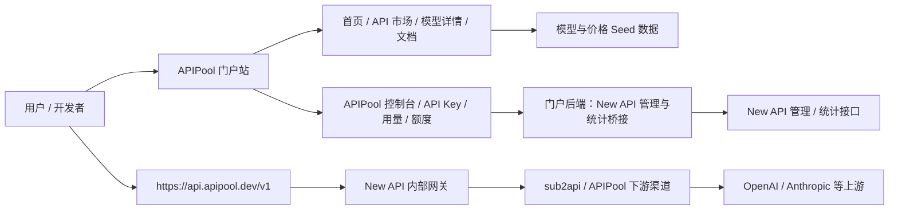

# APIPool v2 MVP 快速上线方案

## 1. 目标

这份文档是完整品牌升级方案的 MVP 版本，目标是尽快上线一个可访问、可展示、可真实调用、可继续迭代的 APIPool 新门户。

MVP 不追求一次性打通完整商业闭环。第一版重点是：

- 让 `apipool.dev` 看起来已经是一个新的 API 门户，而不是旧反代项目后台。
- 完成首页、API 市场、模型详情、文档入口、价格展示这些展示层核心页面。
- 完成登录用户的 APIPool 控制台，包含真实 API Key、真实额度/余额、真实用量和消费日志的最小闭环。
- 基于 ShipAny 模板最大化复用登录、文档、页面框架、支付扩展、数据库和后台骨架。
- 使用 New API 作为内部统一网关，接入 sub2api/APIPool 作为首批下游渠道。

MVP 明确不阻塞在：

- 现有 APIPool 用户迁移。
- Stripe / PayPal 自助支付回调、余额自动入账和订单对账。
- 完整支付账本。
- Playground。
- Logo 和主色最终稿。

## 2. 已确认决策

1. 第一版实际 API 后台确定使用 New API。
2. 用户可见 API Base URL 使用 `https://api.apipool.dev/v1`。
3. New API 首批下游渠道是 sub2api/APIPool。
4. New API 计划部署在同一台服务器上，内部管理域名为 `newapi.apipool.dev`。
5. 第一版必须完成门户到 New API 的用户、Key、额度和用量桥接。
6. 支付方式后续优先 Stripe、PayPal 等国际支付；第一版可先做额度展示和运营调额记录。
7. 第一批重点供应商先覆盖 OpenAI 和 Anthropic。
8. 品牌名继续使用 APIPool。
9. 主域名继续使用 `apipool.dev`。
10. Logo 和主色需要重新设计，但不阻塞 MVP。
11. 第一版不额外支持支付宝/微信支付。
12. 现有 APIPool 用户资产需要迁移，但迁移不进入 MVP。

## 3. MVP 范围

### 3.1 必做

MVP 必须完成：

- 首页：清晰表达 APIPool 是多模型 API 门户。
- API 市场：展示 OpenAI、Anthropic 首批模型。
- 模型详情页：展示模型 ID、能力标签、价格、快速接入示例、FAQ。
- 文档模块：先保留 `/docs` 入口和 Coming soon 信息架构，详细接入文档后续补齐。
- 价格展示：使用 APIPool/LiteLLM seed、New API 倍率参考或人工校验价格，先展示官方价、本站价、计费单位。
- 登录注册：复用 ShipAny 模板能力。
- APIPool 控制台：总览、API Key、用量、账单/额度页。
- New API 对接：门户用户映射、Key 创建/列表/禁用/删除、额度/余额读取、请求数/Token/消费日志/模型分布读取或同步。
- 真实调用链路：`https://api.apipool.dev/v1` 能通过 New API 调用至少一个首批模型。
- 基础品牌替换：APIPool 名称、`apipool.dev` 域名文案、基础导航、页脚。
- SQLite 数据库可运行方案；如部署需要多实例或稳定对账，切换 PostgreSQL。

### 3.2 可做但不阻塞

- 更新日志页。
- 博客入口。
- 自助充值套餐 UI。
- 折扣码输入框。
- 兑换码入口。
- 主题切换。
- 多语言切换。
- Admin 后台入口。

这些可以利用 ShipAny 模板已有能力保留，但不作为 MVP 上线验收核心。未接通真实支付时，支付相关入口必须是 disabled、Coming soon、Contact support 或真实人工处理状态。

### 3.3 不做

MVP 不做：

- 现有 APIPool 用户迁移。
- Stripe / PayPal 自助支付回调、余额自动入账、订单对账。
- 任何面向用户的后台网关控制台相关页面；真实网关只作为后台服务承接调用能力。
- 复杂 Playground。
- 邀请返佣。
- 完整 Admin CMS。
- 大规模 SEO 内容矩阵。
- 通用 Gateway Adapter 或多网关抽象层。

## 4. 架构

MVP 架构保持三层：



用户可以看到：

- Base URL：`https://api.apipool.dev/v1`
- API Key：在 APIPool 门户控制台创建或获取。
- 模型 ID：在 API 市场和模型详情页展示。
- 额度与用量：在 APIPool 门户控制台查看。

用户不应该看到：

- New API 控制台入口。
- `newapi.apipool.dev` 内部域名。
- 后台网关接线细节。

## 5. 技术基线

### 5.1 前端/应用

基于 `/Users/afreecoder/project/shipany-template`。

优先复用：

- Next.js / React / Tailwind。
- 现有 landing block。
- Fumadocs / MDX 文档能力。
- Better Auth 登录注册能力。
- Settings / API Keys / Billing / Credits 页面骨架。
- Stripe / PayPal 支付扩展基础。
- Admin / settings 基础后台骨架。

### 5.2 数据库

MVP 可以选择 SQLite。

依据：

- ShipAny 模板已包含 `src/config/db/schema.sqlite.ts`。
- ShipAny 模板已包含 `src/core/db/sqlite.ts`，使用 `@libsql/client` 和 `drizzle-orm/libsql`。
- `DATABASE_PROVIDER` 支持通过环境变量选择 provider，当前模板已有 SQLite schema 出口。

建议 MVP 配置：

```env
DATABASE_PROVIDER=sqlite
DATABASE_URL=file:./data/apipool-v2.db
DB_SCHEMA_FILE=./src/config/db/schema.sqlite.ts
DB_SINGLETON_ENABLED=true
```

风险：

- SQLite 适合单机快速上线，不适合长期多实例并发写入。
- 如果同时上线真实支付、对账、用户迁移和多服务部署，应切换 PostgreSQL。
- 因此 SQLite 只作为第一版快速上线方案，不作为长期生产账本方案。

## 6. 模型与价格

### 6.1 首批模型

MVP 只展示 OpenAI 和 Anthropic 两个供应商下的模型。

建议首批：

- OpenAI：`gpt-4o`、`gpt-4o-mini`、`gpt-4.1`、`gpt-4.1-mini`、`gpt-5.x` 系列按实际可供给情况确定。
- Anthropic：Claude Sonnet、Opus、Haiku 系列按实际可供给情况确定。

模型数据先用 seed 文件维护，不急着做后台 CMS。

### 6.2 价格来源

价格数据优先级：

1. 人工确认后的本站展示价。
2. APIPool 现有 LiteLLM/model-price-repo seed。
3. New API 的模型倍率/定价配置。

New API 价格机制参考：

- New API 使用模型倍率、补全倍率、分组倍率三层体系计算配额消耗。
- New API 文档说明 `1 美元 = 500,000 配额点数`，余额和消费记录以配额点数为准。
- New API 支持模型倍率、补全倍率和分组倍率配置。
- New API 文档提到支持上游倍率同步，可批量更新本地倍率配置，并允许手动调整覆盖。

MVP 处理方式：

- 市场展示价格先用 `models.seed` 或等价配置。
- 页面展示价格时标注“以实际扣费为准”。
- New API 真实扣费作为控制台余额和用量数据来源。
- 后续再评估是否用 New API 倍率配置反向生成门户价格页。

参考资料：

- New API 倍率设置：https://docs.newapi.pro/zh/docs/guide/console/settings/rate-settings
- New API 定价页说明：https://www.newapi.ai/zh/docs/guide/feature-guide/user/pricing
- APIPool 价格参考：`/Users/afreecoder/project/apipool/backend/internal/service/pricing_service.go`

## 7. 页面清单

### 7.1 首页

目标：让用户一眼知道 APIPool 是多模型 API 平台。

模块：

- Hero：一个 Base URL，接入 OpenAI / Anthropic 等首批模型。
- 热门模型：OpenAI 和 Anthropic 首批模型卡片。
- 快速接入：注册、获取 Key、使用 APIPool Base URL、开始调用。
- 平台优势：统一入口、价格透明、文档清晰、用量可见。
- CTA：查看 API 市场、查看文档。

### 7.2 API 市场

功能：

- 模型列表。
- 分类筛选：LLM。
- 供应商筛选：OpenAI、Anthropic。
- 模型卡片：模型名、模型 ID、简介、价格、标签。
- 排序：默认、热门、价格。

MVP 不做：

- 图像/视频/音频模型完整市场。
- 实时库存/可用性状态。
- 复杂对比表。

### 7.3 模型详情页

每个模型详情页包含：

- 模型名和模型 ID。
- 供应商和能力标签。
- 价格表。
- Base URL 和 API 示例。
- 使用场景。
- FAQ。
- 相关模型。

### 7.4 文档

MVP 文档只保留模块入口，不要求填充完整细节。

入口页建议包含：

- `/docs` 页面。
- Base URL：`https://api.apipool.dev/v1`。
- Quickstart、API Keys、Pricing、SDK Migration、Errors 的占位卡片。
- `Coming soon` 或 `Draft` 状态。

MVP 不要求：

- 完整 quickstart。
- 完整 API Reference。
- 完整 SDK 迁移教程。
- 完整错误码手册。
- 完整计费说明。

### 7.5 APIPool 控制台

控制台必须是真实数据入口，而不是纯占位：

- API Key：列表、创建、复制、禁用/删除、状态读取。
- 接入信息：Base URL、当前 Key、文档链接。
- 基础统计：余额/额度、请求次数、Token 消耗、近 7/30 天消耗趋势。
- 用量日志：时间、Key、模型、状态、Token、Cost。
- 同步状态：最近同步时间、同步中、读取失败、真实空状态。
- 账单/额度：展示真实余额、扣费/调额记录；自助支付未接通时保持 disabled 或 Contact support。

不在门户中设计后台网关控制台入口；真实网关后台在本架构中是后台服务。

## 8. 部署方案

### 8.1 MVP 部署

建议：

- APIPool 门户站部署在 `apipool.dev`。
- 用户 API Endpoint 绑定 `api.apipool.dev`。
- New API 部署在同一台服务器，内部管理域名 `newapi.apipool.dev`。
- 门户后端配置 New API 管理接口密钥，只在服务端调用。
- SQLite 数据文件放在持久化目录，如 `./data/apipool-v2.db`；多实例时切换 PostgreSQL。

### 8.2 第一版联调

第一版上线前必须完成：

- New API 接入 sub2api/APIPool 作为首批下游渠道。
- New API 配置至少一个 OpenAI 或 Anthropic 可售模型。
- 门户后端能创建或绑定 New API 用户。
- 门户后端能创建、列出、禁用或删除 Key。
- `https://api.apipool.dev/v1` 能使用门户创建的 Key 完成真实调用。
- 门户能读取或同步额度、请求数、Token、消费日志和模型分布。

### 8.3 后续部署

后续阶段：

- Stripe / PayPal 支付入账。
- 门户订单成功后同步额度到 New API。
- 开始处理现有 APIPool 用户迁移。
- Logo、主色和视觉系统定稿。

## 9. 用户迁移

现有用户资产需要迁移，但不进入 MVP。

迁移范围后续单独设计：

- 用户账号。
- API Key。
- 余额/额度。
- 历史用量。
- 订单/充值记录。
- 分组/折扣信息。

MVP 只要求页面和数据结构不要把迁移路径堵死：

- 用户表保留外部来源字段。
- API Key 映射表预留 `legacy_user_id`、`legacy_key_id` 或 `metadata`。
- 余额与用量展示通过 DTO 层接入，不写死为某一个后台数据库结构。

## 10. MVP 验收标准

MVP 完成时应满足：

- `apipool.dev` 能展示新版 APIPool 门户。
- 首页明确表达多模型 API 平台定位。
- API 市场能展示 OpenAI 和 Anthropic 首批模型。
- 模型详情页有模型 ID、价格、示例和 FAQ。
- 文档入口存在，并明确详细接入文档后续补齐。
- 用户能注册登录并进入控制台。
- 用户能在 APIPool 控制台创建或获取真实 API Key。
- 用户能用该 Key 调用 `https://api.apipool.dev/v1` 下至少一个模型。
- 控制台能展示真实余额/额度、请求数、Token、消费日志和模型分布，或展示真实空状态/同步状态。
- 门户不会提供后台网关控制台入口。
- 用户可见文案不出现 New API 或内部服务域名。
- SQLite 本地/单机配置能跑通 ShipAny 基础功能。
- Logo 和主色可以先用临时版，但设计上预留替换。

## 11. MVP 之后

下一阶段按优先级推进：

1. Stripe / PayPal 支付入账。
2. 门户订单成功后同步额度到 New API。
3. 现有 APIPool 用户资产迁移。
4. Logo、主色和视觉系统定稿。
5. 扩展图像、视频、音频等更多 API 品类。
6. Playground、导出、邀请返佣和增长内容矩阵。
